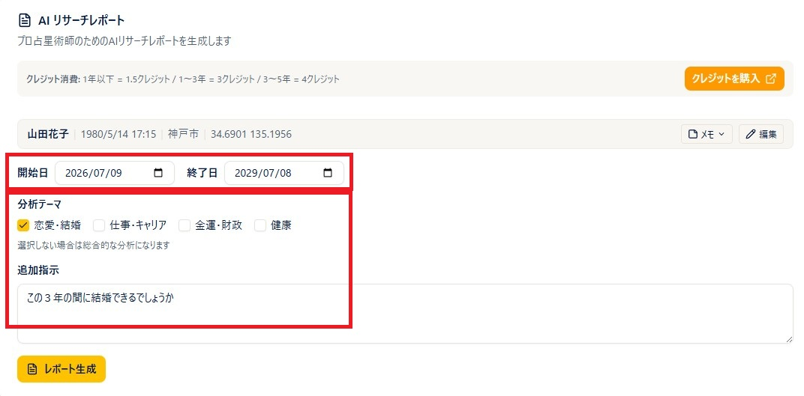
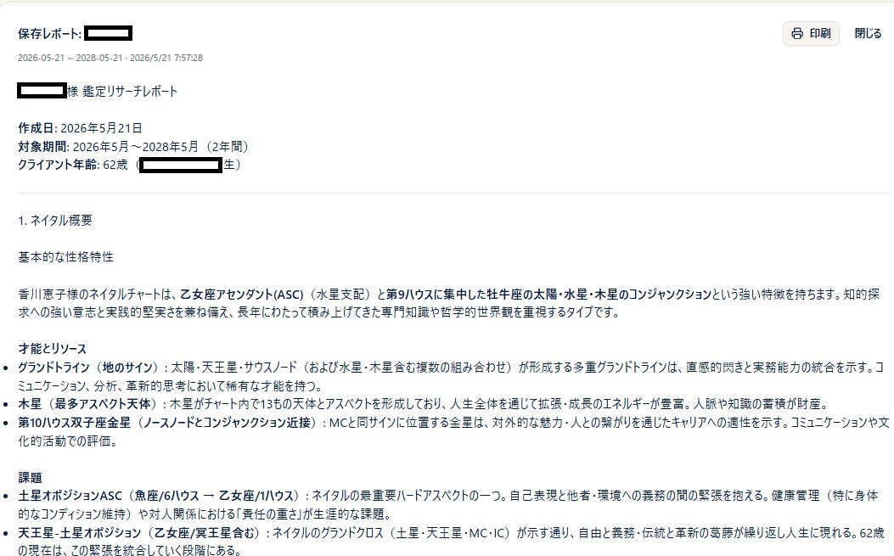
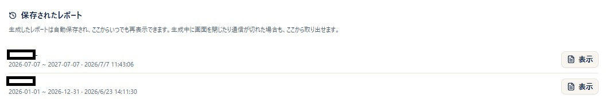
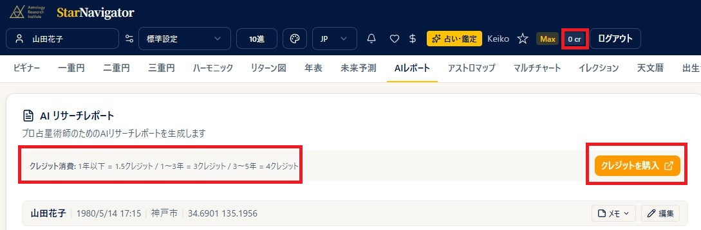
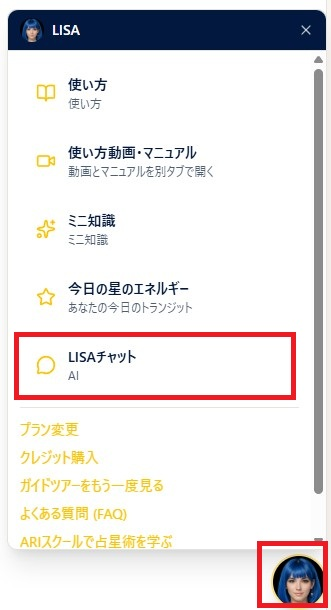

# AIレポート・LISAチャット

!!! abstract "この章について"
    この章では、スタナビのAI機能の使い方をまとめます。メニューの「**AIレポート**」から使う **AI リサーチレポート**（期間を指定して生成する、AI占星術師向けの下準備用の運勢レポート）と、**LISAチャット**（AIと対話形式で鑑定）の操作方法を説明します。「AIレポート」メニューは **Plus プラン以上** でご利用いただけます。**LISAチャット**は画面右下のLISAボタンから使え、**Basic プラン以上** でご利用いただけます。

## AI リサーチレポートを作る

### 操作手順

1. メニューから「**AIレポート**」を開きます。
2. ヘッダーの出生データピッカーから、レポートを作る対象者を選びます（未選択のときは「**出生データを選択してください**」と表示されます）。
3. 選んだ出生データはカード内に表示されます。その場で直したいときは **鉛筆（編集）** から修正し、「**適用**」を押して反映します。
4. 「**開始日**」「**終了日**」で予測期間を指定します（既定は本日から1年後まで）。
5. 「**レポート生成**」を押すと生成が始まり、ボタンが「**レポート生成中...**」に変わります。
6. 生成が終わると、画面下部にレポート結果が表示されます。

!!! tip "生成には数分程度かかります"
    レポート生成には数分程度のお時間がかかります。処理の途中で「まだできない」「壊れてしまったのでは」とご不安に思われるかもしれませんが、レポートが出来上がるまでの間、別の画面に移動して他の作業を進めていただいても問題ありません。作業完了後に元の画面に戻ってきていただければ、作成されたレポートをご確認いただけます（「**保存されたレポート**」の一覧からも取り出せます）。

### 補足説明

- 期間は最大 **5年** です。5年を超えて指定すると「最大期間は5年です。5年を超える場合は分割してください。」と表示されます。終了日が開始日より前・同じ場合もエラーになります。
- 出生データの編集中（「適用」を押していない状態）は、「**レポート生成**」ボタンが押せません。ボタンにカーソルを合わせると「編集中です。下の『適用』を押してください」と案内が出ます。
- 生成にはクレジットを消費します（期間の長さで消費量が変わります。[プラン・クレジット](plan-credits.md)の章を参照）。
- 未保存の編集を適用したまま生成したレポートは、印刷時にヘッダーへ「**未保存の出生データ**」というバッジが付きます。

## 分析テーマと追加指示

### 操作手順

1. 「**分析テーマ**」で、**恋愛・結婚 / 仕事・キャリア / 金運・財政 / 健康** から必要なものにチェックを入れます（複数選択可・任意）。
2. 「**追加指示**」の欄に、AIへ伝えたい要望を自由に入力できます（任意）。
3. 設定したら「**レポート生成**」を押します。

### 補足説明

- 分析テーマを1つも選ばない場合は「選択しない場合は総合的な分析になります」と表示され、総合的な内容で生成されます。
- 「追加指示」欄には、例として「転職のタイミングを重点的に分析してほしい」のような指定ができます。
- 使用するAIモデルは自動で選択されます（画面上に選択欄はありません）。

## レポートの表示・印刷（PDF保存）

### 操作手順

1. 生成が完了すると「**レポート結果**」としてレポート本文が表示されます。消費したクレジットと残高もあわせて表示されます。
2. レポートがある状態では「**印刷**」ボタンが表示されます。押すとブラウザの印刷ダイアログが開きます。
3. 印刷ダイアログで出力先に「PDFとして保存」を選べば、PDFファイルとして保存できます。

### 補足説明

- 印刷・PDFには、対象者の氏名・生年月日時・出生地・予測期間などがヘッダーとして付きます。
- 保存されるファイル名は「AIレポート_（対象者名）」を基にした名前になります。

## 保存されたレポート（履歴）

### 操作手順

1. 生成したレポートは自動で保存され、画面の「**保存されたレポート**」の一覧に並びます。
2. 各項目には対象者名・予測期間・作成日時が表示されます。「**表示**」を押すと、そのレポートを再表示できます。
3. 再表示中のレポートからも「**印刷**」でき、「**閉じる**」で一覧に戻れます。

### 補足説明

- レポートはサーバーに保存されるため、生成中に画面を閉じたり通信が切れた場合でも、この一覧から取り出せます。
- 保存がまだ無いときは「保存されたレポートはまだありません。」と表示されます。

## クレジットの購入

### 操作手順

1. 画面上部にクレジット消費の目安が表示され、その横に「**クレジットを購入**」ボタンがあります。
2. 押すと、別タブで ARI マイページのクレジット購入画面が開きます。
3. クレジットが不足した状態で生成しようとすると「クレジットが不足しています。クレジットを購入してください。」と表示され、そこからも「**クレジットを購入**」に進めます。

### 補足説明

- クレジットの残高は、スタナビ画面上部のヘッダーに常時表示されます。購入は ARI マイページで行い、スタナビ上のボタンはその画面への入口です。

## LISAチャット（AI鑑定）

### 操作手順

1. 画面右下の **LISA（丸いアバター）ボタン** を押し、メニューから「**LISAチャット**」を選びます。
2. あらかじめ、チャートページなどで出生データを選んでおきます（未選択のときは「チャートページで出生データを選択してから、チャットを開始してください。」と表示されます）。
3. クレジット消費の説明を読み「**同意して続ける**」→「**チャットを始める**」を押すとセッションが始まります。
4. 下部の入力欄に質問を入力して送信すると、LISAが対話形式で回答します。
5. 会話を終えるときは「**セッション終了**」を押し、「**要約を保存して終了**」または「**要約を削除して終了**」を選びます。

### 補足説明

- 選択中の出生データに基づいて回答します。登録済みの他の人のデータを参照したり、相性について質問することもできます。
- 「**要約を保存して終了**」を選ぶと、その会話の要約が次回のチャットに引き継がれます。過去の会話は「**過去のチャット履歴を見る**」（LISAチャット履歴ページ）からいつでも再閲覧・印刷できます。
- 「**自分自身のデータ**」にチェックを入れると、二人称（「あなた」）で回答します。
- チャットの開始には残高が **2クレジット以上** 必要です（開始時点では消費されません）。会話の量に応じて0.1クレジット単位で随時課金されます。

!!! info "プラン・クレジット"
    - **AI リサーチレポート**：**Plus プラン以上**。生成のたびにクレジットを消費します（**1年以下＝1.5クレジット／1〜3年＝3クレジット／3〜5年＝4クレジット**）。
    - **LISAチャット**：**Basic プラン以上**。開始には残高 **2クレジット以上** が必要（開始時は消費なし）で、会話量に応じて0.1クレジット単位で課金されます。時期予測を含む質問は最大5年分のデータを取得するため1回で1〜2クレジット消費することがあり、途中で止まらないよう **5クレジット程度** の残高での開始が推奨されています。
    - クレジットの購入は、各画面の「**クレジットを購入**」ボタンから ARI マイページで行います。
