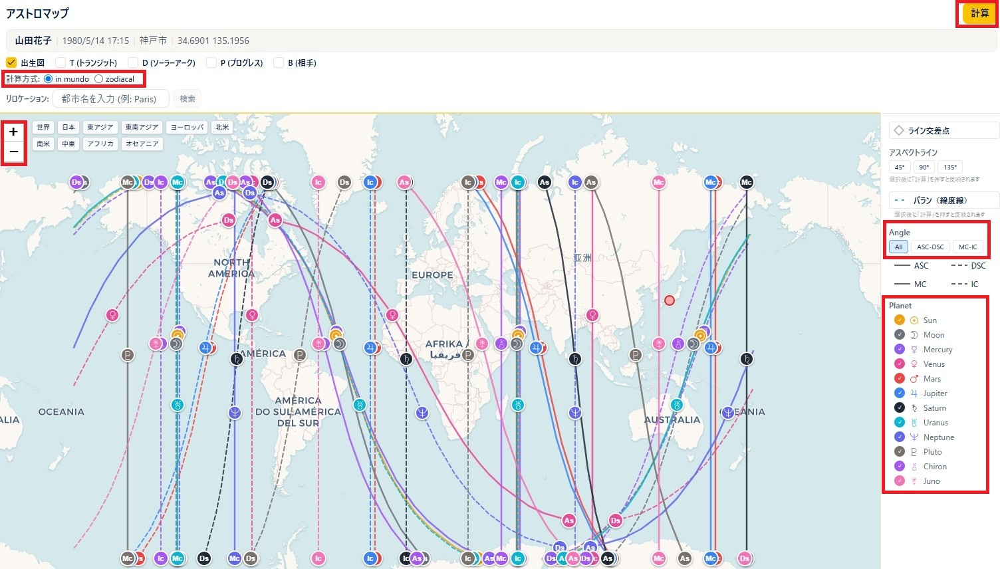
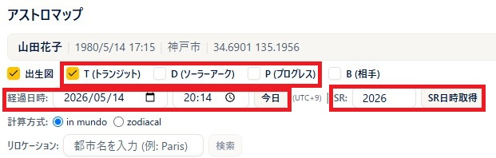
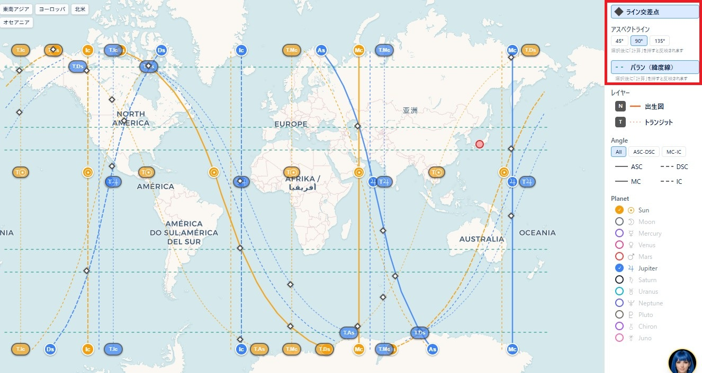
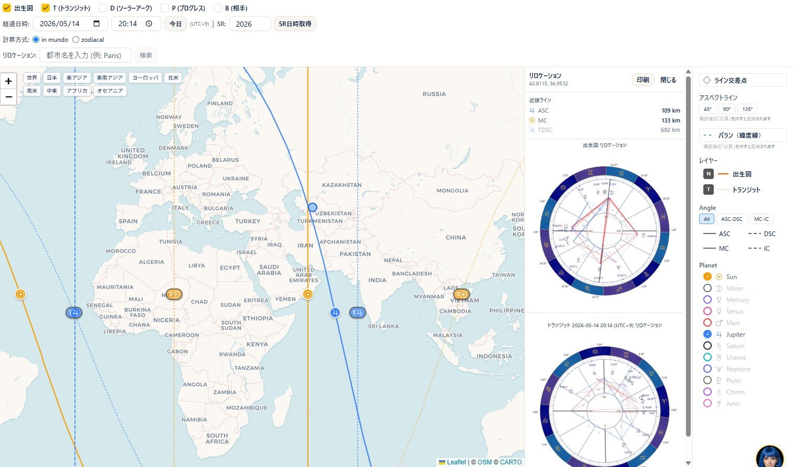

# アストロマップ

!!! abstract "この章について"
    この章では、アストロマップの使い方をまとめます。アストロマップは、出生図の天体が地平線・子午線に重なる **ライン** を世界地図上に描き、土地との関係を見る機能です。アストロマップは **Pro プラン以上** でご利用いただけます（トランジット・ソーラーアーク・プログレスを重ねて時期的な要素を見る機能、リロケーション、パランなどの高度な機能は **Max**）。

## アストロマップの作り方

### 操作手順

1. メニューから「**アストロマップ**」を開きます。
2. 「**出生データ**」を選びます（「**出生地**」が表示されます）。
3. 「**計算方式**」で **in mundo** または **zodiacal** を選びます。
4. 「**表示アングル**」で、**ASC／DSC／MC／IC** の表示・非表示を切り替えます。
5. 「**計算**」を押すと、地図上にラインが描かれます。

### 補足説明

- 「**in mundo**」は、天体の実際の位置（赤経・赤緯）から、地平線上に昇っている・沈んでいる・南中している地点を計算する方式です（既定・astro.comの標準と同じ）。「**zodiacal**」は、天体の黄経だけを使う簡易的な計算方式です。2つの方式では、ラインの位置が数十〜数百kmずれることがあります。迷ったら「in mundo」のままで問題ありません。
- ラインが見つからない場合は「**ラインが見つかりませんでした**」と表示されます。
- 地図は左上の「**＋**」「**−**」ボタンで拡大・縮小できます。スマートフォンでは、指で広げる操作（ピンチアウト）でも拡大できます。
- 地図上部の**地域プリセット**（世界／日本／東アジア／東南アジア／ヨーロッパ／北米／南米／中東／アフリカ／オセアニア）を押すと、その地域へすばやくズームできます。
- 出生地は、地図上に**赤い丸**で示されます。
- 右側の「**Angle**」欄では、個別クリックのほか「**All／ASC-DSC／MC-IC**」のボタンでまとめて切り替えられます。
- 右側の「**Planet**」欄のチェックで、天体ごとにラインの表示・非表示を切り替えられます（再計算は不要です）。
- ラインは **ASC／MC＝実線、DSC／IC＝破線** で表示されます。出生図（N）以外（T／D／P／Bなど）のラインは点線で区別されます。
- 各ラインには、**両端**と、その天体が**真上（天頂）に来る緯度**の3か所にマークが表示されます。ラインにマウスを乗せると、天体記号とアングル名がツールチップで表示されます。

## 時期的な影響を重ねて見る（T／D／P／SR）

### 操作手順

1. 出生図（N）に加えて、時期的な影響を見たい場合は **T（トランジット）／D（ソーラーアーク）／P（プログレス）** にチェックを入れます。
2. T／D／Pのいずれかにチェックを入れると、「**経過日時**」の入力欄が現れます。日付・時刻を指定します（「**今日**」ボタンで現在日時に戻せます）。
3. 同時に「**SR**」欄も現れます。ソーラーリターンの時期を見たい場合は年を入力して「**SR日時取得**」を押すと、その年のソーラーリターン日時が自動でセットされます。

### 補足説明

- T／D／P／SRは、出生図の天体だけでなく、指定した日時の経過（トランジット）・ソーラーアーク・プログレス・ソーラーリターンの天体位置でもラインを描く機能です。時期によって天体位置は変わるため、これらを重ねることで「いつ頃、どの土地との関係が強くなるか」といった時期的な要素を見ることができます。
- 「経過日時」「SR」欄は、T／D／Pのいずれかにチェックが入っているときだけ表示されます。
- N（出生図）に加えてT／D／Pなど複数の図を計算すると、右側の凡例に「**レイヤー**」欄が新しく現れます。ここでは、計算済みの各図（N／T／D／Pなど）の表示・非表示を、再計算せずに切り替えられます。
- T／D／P／SRは、上位プランの機能です（下記プラン欄参照）。

## 相手の図を重ねて見る（B）

### 操作手順

1. **B（相手）** にチェックを入れると、相手の出生データを選ぶ欄が現れます。
2. 相手の出生データを選ぶと、そのラインも地図に重ねて表示されます。

### 補足説明

- こちらは時期的な要素ではなく、相手（もう一人）の出生図のラインを重ねて、二人の相性的な土地の関係を見る機能です。
- Bも、上位プランの機能です（下記プラン欄参照）。

## ライン交差点・アスペクトライン・パラン

### 補足説明

- **ライン交差点**：複数のラインが交わる地点を表示します。
- **アスペクトライン**：天体が 45／90／135 度でアングルに関わるライン（点線）です。狭い地域の鑑定向けの補助で、選択後に「**計算**」を押すと反映されます。
- **パラン（緯度線）**：2つの天体が同時にアングルに乗る緯度（水平線）を表示します。表示中の天体ペアが対象です。
- ※ アスペクトライン・パランなどの高度な表示は **Max プラン** の機能です。

## リロケーション

### 操作手順

1. 地図をクリックすると、その地点の **リロケーションチャート**（引っ越し先などでの出生図）が表示されます。
2. または「**リロケーション**」欄に都市名を入力して「**検索**」します。

### 補足説明

- クリックした（または検索した）リロケーション地点は、地図上に**青い丸**で示されます。
- **T（トランジット）** などにチェックを入れた状態でリロケーション地点をクリックすると、出生図をリロケーションしたチャートに加えて、チェックしているT／D／Pをその地点・日時でリロケーションしたチャートもあわせて表示されます。
- リロケーションパネルには「**近接ライン**」として、クリックした地点の近くを通っているラインとその距離（km）が自動で一覧表示されます。
- リロケーションは上位プランの機能です（下記プラン欄参照）。

!!! info "プラン"
    アストロマップ（基本・出生図のライン）＝ **Pro 以上**。トランジット・ソーラーアーク・プログレス・SRを重ねて時期を見る機能、相手（B）のライン表示、リロケーションなどの高度な機能＝ **Max 以上**。
