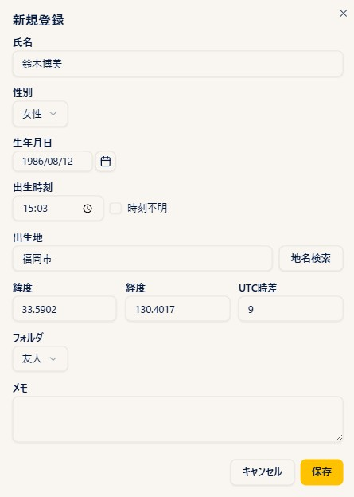
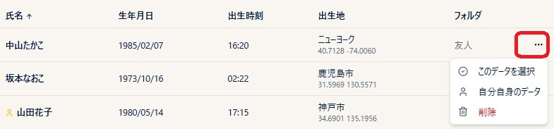
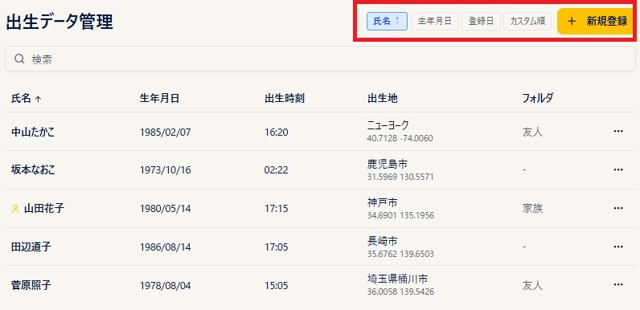
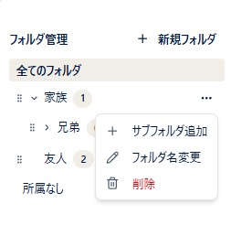

# 出生データ

!!! abstract "この章について"
    この章では、出生データの登録・管理・並べ替え・指定の操作と、共有データ（天文イベント）の使い方をまとめます。

## 出生データの登録

{ width="460" }

### 操作手順

1. メニューから **「出生データ」** を開きます。
2. **「新規作成」** ボタンを押します。
3. **名前**（必須）・**性別**（任意）・**生年月日**・**出生時刻** を入力します。
4. **出生地** を入力します。地名を打ち始めると **候補が出る** ので選択するか、入力後に **「地名検索」** ボタンを押すと、緯度経度・UTC 時差が自動で入ります。
5. （任意）**フォルダ** を指定して整理場所を決めます（フォルダの作り方は **フォルダ管理** を参照）。
6. （任意）**メモ** 欄に自由記述を残せます（鑑定のメモなど）。
7. **「保存」** ボタンを押します。

### 補足説明

- 出生時刻が分からない場合は **「時刻不明」チェックボックス** にチェックを入れます。チェックすると **ASC（アセンダント）・MC** はチャート上に表示されません。また自動的にソーラーサインハウスシステムが使用されます。月は **12時（正午）で計算** されますが、実際の出生時刻により **6〜7度の誤差** がありうるため、時刻不明の場合 **月のアスペクトは表示されません**。
- 「地名検索」で見つからない場所（海外の小さな町など）は、**緯度・経度を直接入力** できます。その場合 **UTC 時差** も手入力してください。
- **性別** は鑑定実務での識別用で、入力しなくてもチャート計算には影響しません。
- **名前** は必須ですが、本名にこだわらず **ニックネームやイニシャル** でも構いません。
- 保存後の修正は、一覧画面で名前をクリックして開き直すか、チャート画面の **鉛筆ボタン** からできます。

## 出生データの削除

### 操作手順

1. 出生データ一覧で、削除したいデータの行にある **「…」（三点メニュー）** を開きます。
2. 一番下の **ゴミ箱アイコンの「削除」** を選びます。
3. 確認ダイアログで **「削除」** を押すと、出生データが削除されます。
4. あるいは、出生データを開き、その下部にある **削除ボタン** を押しても削除できます。

### 補足説明

!!! warning "削除は元に戻せません"
    削除した出生データは元に戻せません。ピッカーやフォルダ内、さらにそのデータで作ったチャートの参照も表示されなくなります。

- 「自分自身のデータ」に指定しているデータを削除すると、「今日の星のエネルギー」スプラッシュに使う出生図も同時に参照されなくなります。必要に応じて、先に別のデータを「自分自身のデータ」に指定し直してください（**自分のデータを指定する** を参照）。

## 一覧の並べ替え

### 操作手順

1. 一覧画面上部の **「氏名」「生年月日」「登録日」** のいずれかのボタンを押すと、その項目で並び替わります。
2. 同じボタンをもう一度押すと、昇順 ↔ 降順 が入れ替わります（ボタン横に ↑ / ↓ が出ます）。
3. **「カスタム順」** を選ぶと、行を **ドラッグして任意の順番に並べ替え** られます。並べ順は自動保存されます。
4. 画面上部の **検索ボックス** に名前の一部を入力すると、該当データだけに絞り込まれます。

### 補足説明

- **カスタム順** は、「よく使う人を上に」「グループごとに近づける」など、自分の使いやすさで並べたいときに使います。
- 一重円・三重円などのチャート作成画面にある **「出生データピッカー」では、一覧画面での並べ順（カスタム順を含む）は反映されず、常に登録順で表示されます**。
- そのためピッカーでは、フォルダから絞り込むか、**検索ボックスに名前を打ち込む** ほうが早く見つかります。
- 「カスタム順」で並べた順番はデータに保存されているので、画面を閉じても消えません（もう一度「カスタム順」を選べば、その並びが出てきます）。

## フォルダ管理

### 操作手順

1. 出生データ一覧画面の **「+ 新規フォルダ」** を押して、フォルダを作ります。
2. フォルダ行の **「…」（三点メニュー）** から「**サブフォルダ追加**」を選ぶと、そのフォルダの下に子フォルダができます。**3 階層まで** 作れます（フォルダ → 子フォルダ → 孫フォルダ）。同じメニューから「**フォルダ名変更**」「**削除**」もできます。
3. 出生データの登録・編集画面で **「フォルダ」** 欄から入れたいフォルダを選ぶと、その出生データがフォルダに入って整理できます。
4. フォルダ名をクリックすると、一覧がそのフォルダのデータに絞り込まれます。「**全てのフォルダ**」をクリックすると絞り込みを解除、「**所属なし**」をクリックするとフォルダに入っていないデータだけを表示します。
5. 出生データピッカーでも、**フォルダ階層をたどって** 出生データを探せます。

### 補足説明

- フォルダは「家族」「お客様 A 社」「あ行」など、グループでまとめるとピッカーで探しやすくなります。
- フォルダ行の左端の **つまみをドラッグ** すると、フォルダの並び順を変えられます。
- フォルダを削除しても、中の出生データは消えません。サブフォルダは親フォルダに繰り上がり、そのフォルダ直下のデータは「所属なし」に移動します。
- データを別のフォルダに移したいときは、出生データの編集画面でフォルダ欄を変えて保存します。
- フォルダに入っていない出生データは、ピッカー上では **「所属なし」** のグループにまとめて表示されます。
- 一覧画面の検索ボックスは **フォルダをまたいで** 名前で検索できます。出生データピッカーでも名前で検索できます。

## 自分のデータを指定する

### 操作手順

1. 出生データ一覧で、自分の出生データの行にある **「…」（三点メニュー）** を開きます。
2. **「自分自身のデータ」** を選びます。
3. 一覧の氏名欄に金色の人型アイコンが付きます。指定済みのデータの三点メニューを開くと、「自分自身のデータ」の右に **「*」** が表示されています。

### 補足説明

- 「自分自身のデータ」に指定したデータは、**Basic 以上のプラン** の場合、スタナビにログインしたとき「今日の星のエネルギー」スプラッシュがご自身の出生図に基づいて表示されます。
- チャート作成時のデフォルト出生データとしては使われません。各チャート画面では、その都度「出生データピッカー」から対象を選んでください。
- 指定を解除したいときは、同じメニューでもう一度 **「自分自身のデータ」** を選ぶと選択が解除されます。

## 共有データ（新月・満月などの天文イベント）

<!-- 画像さしこみ: 共有データ -->

各チャート画面の **出生データピッカー** には、ご自身で登録した出生データに加えて、**「共有データ」** セクションがあります。ここには新月・満月などの天文イベントの日時データが、あらかじめ登録されています。

### 操作手順

1. チャート画面のヘッダーで **出生データピッカー** を開きます。
2. 「個人データ」の下にある **「共有データ」** セクションを開きます。
3. フォルダをたどるか、検索ボックスにイベント名を入力して、目的の天文イベントを選びます。
4. そのまま計算すると、そのイベントの瞬間のホロスコープを作成できます。

### 補足説明

- 共有データは ARI 側で管理しているデータです。ご自身での編集・削除はできません。また出生データの一覧画面には表示されず、ピッカーからのみ選択できます。
- 場所（緯度・経度）が設定されていないイベントを選ぶと、設定の **デフォルト観測地** が自動で補われ、日時もその観測地の時差に換算されます（イベントの瞬間そのものは変わりません）。先に [設定](settings.md) の章の「デフォルト観測地」を登録しておいてください。
- [年表](timeline.md) でも、共有データを対象として選べます。
