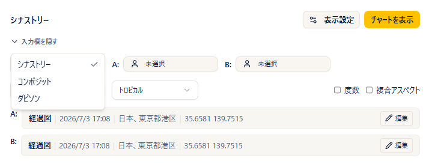
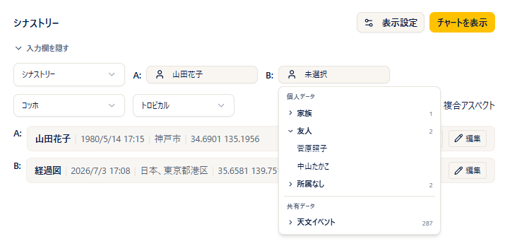

# 二重円

!!! abstract "この章について"
    この章では、二重円（2つのチャートを重ねて見る図）の使い方をまとめます。二重円には **シナストリー**・**コンポジット**・**ダビソン** の3種類があります。

    シナストリーの占星術的な考え方は、ARI公式サイトの [二重円（シナストリー）](https://www.arijp.com/basis/synastry) もあわせてご覧ください。

## チャートの種類を選ぶ

### 操作手順

1. メニューから「**二重円**」を開きます。
2. 左上の種類セレクトで **シナストリー / コンポジット / ダビソン** のいずれかを選びます。
3. 種類を切り替えると、入力済みのデータで自動的に再計算されます。

### 補足説明

- **シナストリー**：2人の出生図を内円・外円に重ねて表示します。
- **コンポジット**：2人の中間点から作る合成図です（1つの円で表示）。
- **ダビソン**：2人の出生日時・場所の平均から作る図です（1つの円で表示）。図の下に「**平均日時**」「**平均場所**」が表示されます。
- 利用できないプランの種類には鍵アイコンが付き、選べません。

!!! info "プラン"
    シナストリー＝Free 以上／コンポジット＝**Pro 以上**／ダビソン＝**Max 以上**。

## 二重円の作り方

### 操作手順

1. 入力欄で、**A（内円）** と **B（外円）** のピッカーから、それぞれ保存済みの出生データを選びます。
2. データをその場で直したいときは、各人物の下の **鉛筆（編集）** から修正します（編集中は「**再計算**」を押して反映します）。
3. 必要に応じて **ハウスシステム**、**黄道帯（トロピカル／サイデリアル(ラヒリ)）** を選びます。
4. 「**チャートを表示**」を押すと、二重円が表示されます。

### 補足説明

- 片方のピッカーを未選択にすると、その枠は「現在時刻・既定の観測地」で補われます。
- 計算に成功すると入力欄は自動で折りたたまれます。「**入力欄を表示**」でもう一度開けます。
- シナストリーでは **A＝内円・B＝外円** で表示されます。コンポジット・ダビソンは1つの円で表示されます。
- **新月図・満月図を重ねたいとき**は、出生データピッカーの **共有データ（新月・満月などの天文イベント）** から選べます。ご自身で登録しなくても、A または B に選ぶだけで、その時点の図を重ねられます。

## 右パネルの見方

<!-- 画像さしこみ: 二重円 右パネル -->

### シナストリーのとき

- **天体・ハウス** タブ：A・Bそれぞれの天体一覧。「**在住ハウス**」＝自分の図でのハウス、「**相手のハウス**」＝相手の図に入るハウスを表示します（見出しは「A (内円)」「B (外円)」）。
- **クロスアスペクト** タブ：「**A × B クロスアスペクト**」「**A さん ネイタル**」「**B さん ネイタル**」の3区分で、天体・アスペクト・**オーブ**・キーワードを表示します。キーワードはクリックで全文が開きます（オーブが1度以内は太字）。
- **グリッド** タブ：A×B のクロスグリッド（相性カラー）と、A・B 各自のネイタルグリッドを表示します。クロスグリッドの向きは「**A ↓ B →**」。下に **相性カラー凡例**（ARI独自・オーブ5度以内）＝ 赤＝強い緊張／オレンジ＝課題／青＝調和 が付きます。

### コンポジット・ダビソンのとき

- **天体／ハウス／アスペクト／分析** の4タブ（一重円と同じ構成）で表示されます。

## アスペクトと複合アスペクト

<!-- 画像さしこみ: 二重円 アスペクト -->

### 補足説明

- 円盤には、A×B のクロスアスペクト線と、A同士・B同士のアスペクト線が描かれます（設定のオン/オフ・オーブに従い、広いオーブは点線になります）。
- **複合アスペクト**：チェックボックス「**複合アスペクト**」をオンにすると、A＋B の複合パターンを計算して表示します（**Basic プラン以上**。計算に少し時間がかかるので、必要なときだけオンにしてください）。
- 天体をクリックすると、その天体のアスペクト一覧がポップアップし、**接近中／分離中** も表示されます（内円A＝赤、外円B＝青のバッジ）。**ASC・MC** などのアングルもクリックできます。
- アスペクトの基礎は、ARI公式サイトの [アスペクト](https://www.arijp.com/basis/aspect) もご覧ください。

## 表示・印刷

<!-- 画像さしこみ: 二重円 表示オプション -->

### 操作手順

1. 「**度数**」にチェックを入れると、円盤に各天体の度数が表示されます。
2. 「**印刷**」ボタンで、チャートとデータを印刷できます（**Basic プラン以上**）。
3. 円盤をクリックすると拡大表示になり、拡大画面から「**PNG**」で画像を保存できます（PNG保存は **Basic プラン以上**）。

### 補足説明

- **クイック設定** ボタンから、その場で表示天体・アスペクトを調整できます（**Plus プラン以上**）。
- 「**小惑星・感受点を表示**」は、Free／ゲスト向けの簡易切り替えです（Basic 以上は設定画面で管理します）。
- 度数の表記（10進／度分）は、設定の度数モードに従います。
