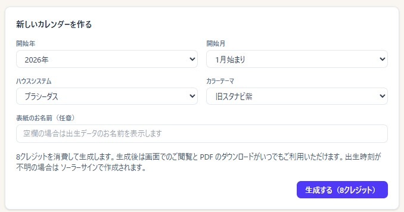
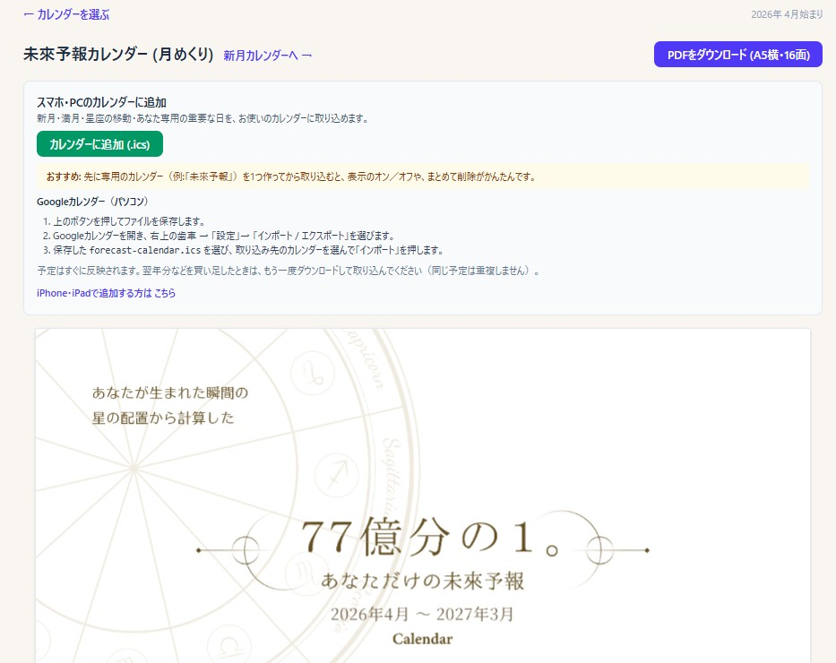
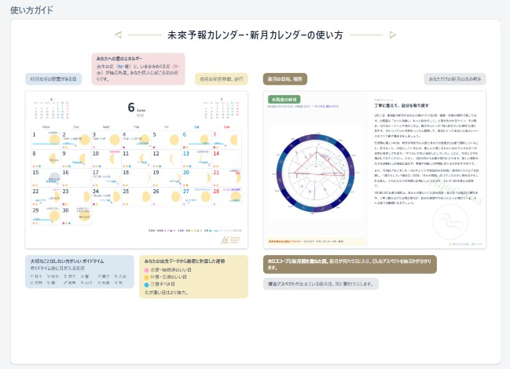

# 未來予報カレンダー

!!! abstract "この章について"
    この章では、未來予報カレンダーの使い方をまとめます。未來予報カレンダーは、あなたの出生図から作る **1 年分のあなただけのカレンダー**（月めくり＋新月読みの2冊セット）です。会員は、スタナビ内で作成・閲覧・PDF ダウンロード・カレンダー連携ができます（**Basic プラン以上**。無料プランやご自身以外の分は外部の購入ページから）。

## カレンダーを作る

### 操作手順

1. ヘッダー「**占い・鑑定**」→「未來予報カレンダー」の「**作成・購入する**」で、作成画面を開きます。
2. 「**＋ 新しいカレンダーを作る**」を押します。
3. 次の項目を設定します。
    - **開始年**（2026／2027／2028）
    - **開始月**（1月始まり／4月始まり／誕生月始まり）
    - **ハウスシステム**（プラシーダス／コッホ／ソーラーサイン）
    - **カラーテーマ**（標準／旧スタナビ紫）
    - **表紙のお名前**（任意・空欄なら出生データの名前）
4. 「**生成する（8クレジット）**」を押すと、生成が始まります（完成まで数分）。

### 補足説明

- カレンダーは **ご自身（「自分のデータ」に設定した出生データ）** のみ作成できます。「[出生データ](birth-data.md)」で1件を「自分のデータ」に設定してください。
- **出生時刻が不明の場合はソーラーサイン** で作成されます。
- **2028 年版は「1月始まり」のみ** です。
- クレジットが足りないときは「**クレジットを購入**」から、ARI マイページで購入できます。
- ご自身以外の分や、無料プランの方は、外部の購入ページから購入します。**PDF 版（税込 4,200 円）** と **印刷版（税込 8,000 円）** があり、どちらも **PDF のダウンロードリンクがメールで届きます**。印刷版は、あわせて卓上カレンダーが郵送で届きます。
- **スタナビ内でいつでも閲覧できること**と、後述の**カレンダー連携**は、スタナビ内でご自身の分を作成した場合だけの機能です。外部購入のカレンダーでは利用できません。

## 閲覧・ダウンロード

### 操作手順

1. 生成が終わると、画面に **PDF がそのまま表示** されます（スマホはピンチで拡大できます）。
2. 「**PDF をダウンロード（A5 横）**」で PDF を保存できます。
3. 「**新月カレンダーへ →**」で、新月読みのカレンダーに切り替えられます。

### 補足説明

- 作成済みのカレンダーは、「**あなたのカレンダー**」一覧からいつでも再表示できます（状態＝「閲覧できます」／「生成中」／「失敗」）。
- 同じ開始年・開始月の組み合わせは1回だけ生成され、再表示ではクレジットは消費されません。
- 画面の「**使い方ガイド**」で、月めくりカレンダーと新月カレンダーの見方を確認できます。
    

## スマホ・PC のカレンダーに追加

### 操作手順

- **iPhone・iPad**：「**iPhone・iPad のカレンダーに追加**」を押し、表示に従って「**検索**」→「**取り込む**」の順に押します。「**未來予報カレンダー**」という専用カレンダーが作られ、予定が入ります（購読方式）。
- **パソコン・Android**：「**カレンダーに追加（.ics）**」でファイルを保存し、Google カレンダーの「設定 → インポート／エクスポート」から取り込みます。

### 補足説明

- 新月・満月・星座の移動・あなた専用の重要な日などが、お使いのカレンダーに入ります。
- 端末は自動で判定されます。もう一方の手順は「〜で追加する方はこちら」から開けます。
- このカレンダー連携（iPhone・iPad の購読／.ics の取り込み）は、**スタナビ内で作成したカレンダーだけの機能**です。外部の購入ページで購入した場合は利用できません。

!!! info "プラン・クレジット"
    スタナビ内での作成・閲覧・PDF・カレンダー連携は **Basic 以上**（無料プランやご自身以外の分は外部購入）。生成は **1 回 8 クレジット** を消費します。

!!! info "外部の購入ページで購入した場合との違い"
    外部の購入ページには **PDF 版（税込 4,200 円）** と **印刷版（税込 8,000 円）** があり、どちらも **PDF のダウンロードリンクがメールで届きます**。印刷版は、あわせて卓上カレンダーが郵送で届きます。**スタナビ内でのいつでも閲覧と、スマホ・PC のカレンダー連携は、スタナビ内で作成した場合だけの機能**で、外部購入では利用できません。
