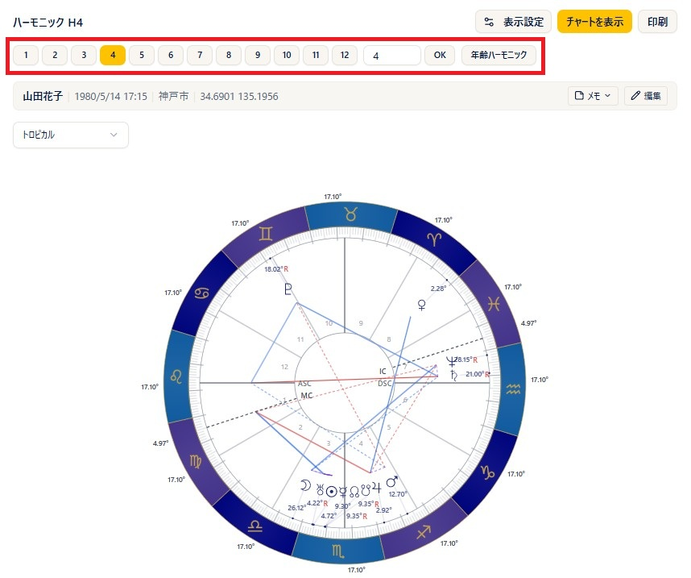
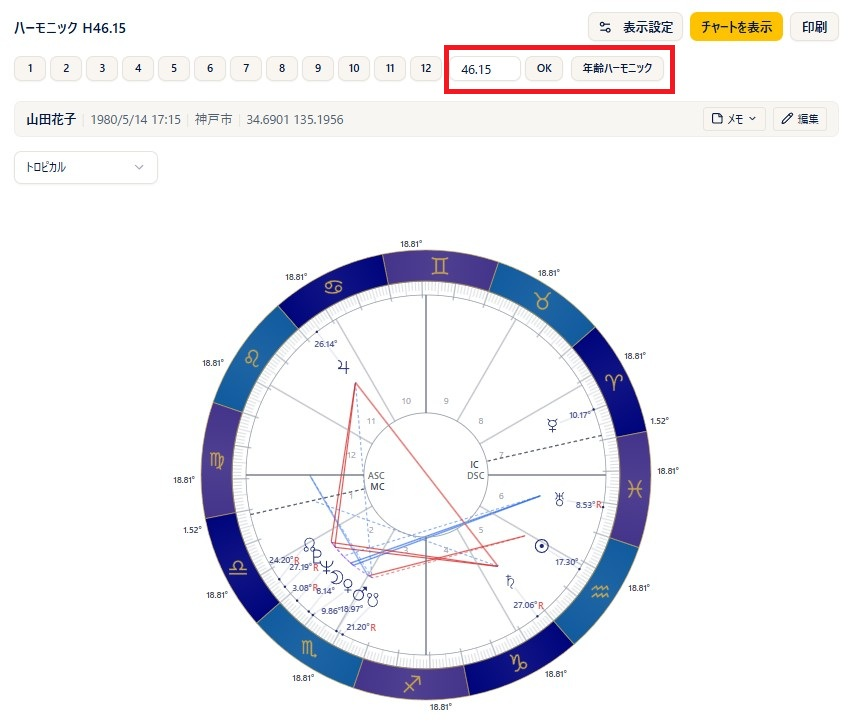
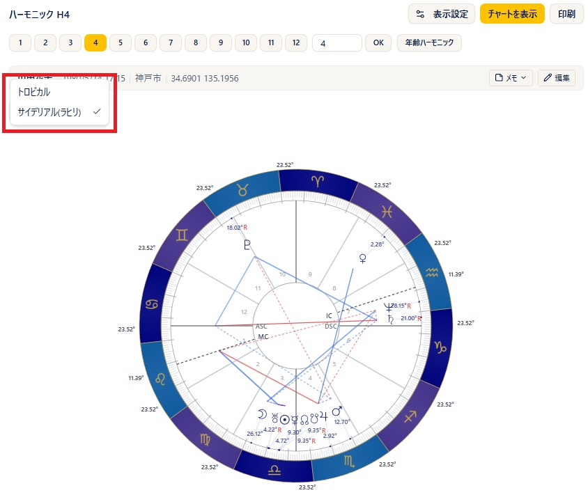
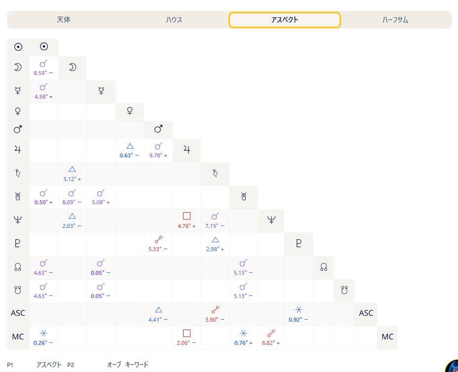
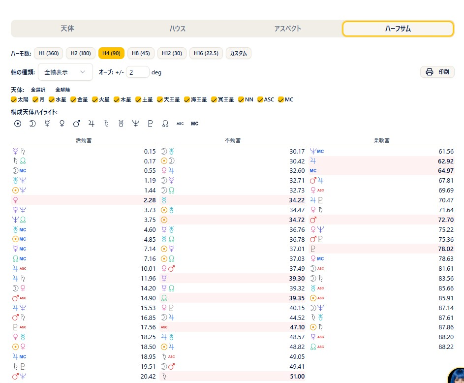

# ハーモニック

!!! abstract "この章について"
    この章では、ハーモニック（調波）チャートの使い方をまとめます。ハーモニックは、出生図を指定した **ハーモニック数** で変換して表示する機能です。プリセット（1〜12）から選ぶほか、カスタム値の入力や、対象者の年齢で計算する **年齢ハーモニック** も使えます。

    画面は左に **ハーモニック円**、右に **右パネル（天体・ハウス・アスペクト・ハーフサム）** の2分割で、ハーフサム（ミッドポイント）も同じ画面で確認できます。ハーモニックは **Pro プラン以上** でご利用いただけます。

## ハーモニックチャートの作り方

### 操作手順

1. メニューから「**ハーモニック**」を開き、ヘッダーで **出生データ** を選びます。
2. データをその場で直したいときは **鉛筆（編集）** から修正し、「**再計算**」で反映します。
3. 上部の **プリセット（1〜12）** のボタンから、見たいハーモニック数を選びます。ボタンを押すとその場で計算・表示されます。
4. プリセットにない数を見たいときは、右の入力欄に数値を入れて「**OK**」を押します（**Enter キー** でも確定できます）。小数（例：4.5）も入力できます。
5. 出生データを選んでいるときは、「**チャートを表示**」ボタンで、現在のハーモニック数で再計算できます。

### 補足説明

- チャート上部のタイトルには、現在のハーモニック数が「**ハーモニック H〇**」の形で表示されます。
- 出生データを選ばずに開いた場合、プリセット・カスタム入力・年齢ハーモニックの操作欄は表示されません。出生データを選ぶと表示されます。
- カスタム入力は 0.01 以上の数値を受け付けます。数値以外や 0 以下は無視されます。
- 黄道帯を変更すると、同じハーモニック数のまま自動で再計算されます。

## 年齢ハーモニック

### 操作手順

1. ヘッダーで **出生データ** を選びます（出生データを選んでいるときだけボタンが表示されます）。
2. 「**年齢ハーモニック**」ボタンを押します。
3. 生年月日から算出した現在の満年齢（小数第2位まで）が、そのままハーモニック数として計算・表示されます。

### 補足説明

- 算出された年齢はカスタム入力欄にも反映されるので、そこから微調整して再計算することもできます。

## 黄道帯の選択

### 操作手順

1. **黄道帯** の選択肢から、**トロピカル** または **サイデリアル(ラヒリ)** を選びます。
2. 変更すると、同じハーモニック数のまま自動で再計算されます。

### 補足説明

- ハーモニック図のハウスは常に**等分（ハーモニック変換後のASCから30度ずつ）**で計算されるため、他のチャートと違い、ハウスシステムの選択肢はありません。
- MC はハーモニック変換後の位置がそのまま表示され、ハウスカスプとは連動しません（浮動MC）。

## 右パネルの見方

### 補足説明

- タブは **天体／ハウス／アスペクト／ハーフサム** の4つです。
- **天体** タブ：ハーモニック変換後の天体一覧（天体・サイン・度数など）を表示します。
- **ハウス** タブ：ハウスの一覧と、各ハウスの天体を表示します。
- **アスペクト** タブ：ハーモニック図内のアスペクト一覧・グリッドを表示します。**複合アスペクト** があればあわせて表示されます。
- **ハーフサム** タブ：ハーフサム（ミッドポイント）を表示します。
- チャートがまだ計算されていないときは、各タブに「データがありません」と表示されます。

## ハーフサム（ミッドポイント）

### 操作手順

1. 右パネルの「**ハーフサム**」タブを開きます。
2. **ハーモ数** や **軸の種類（全軸表示／軸刺激表示）** を切り替えて、見たい内容を選びます。
3. タブ内の「**印刷**」ボタンで、ハーフサムを横向きで印刷できます。

### 補足説明

- ハーフサムのハーモ数は、ハーモニック円のハーモニック数とは別に指定できます。
- ハーフサムの基礎は、ARI公式サイトの [ハーフサム](https://www.arijp.com/basis/halfsum) もあわせてご覧ください。

## 表示・印刷

### 操作手順

1. 「**印刷**」ボタンで、ハーモニック円とデータを縦向きで印刷できます。ファイル名には「ハーモニック」とハーモニック数（H〇）が付きます。
2. 円盤をクリックすると拡大表示になり、拡大画面から「**PNG**」で画像を保存できます。
3. 「**表示設定**」ボタンから、その場で表示天体・アスペクトを調整できます。

### 補足説明

- 印刷ボタンは、チャートが計算されているときにだけ表示されます。
- 出生データを編集して再計算した状態で印刷すると、編集中である旨の注記が印刷ヘッダーに付きます。

!!! info "プラン"
    ハーモニックの利用は **Pro 以上** です（メニューに鍵アイコンが付く場合は、そのプランでは開けません）。ページを開ければ、ハーフサムや表示設定など内部の機能もすべて利用できます。
