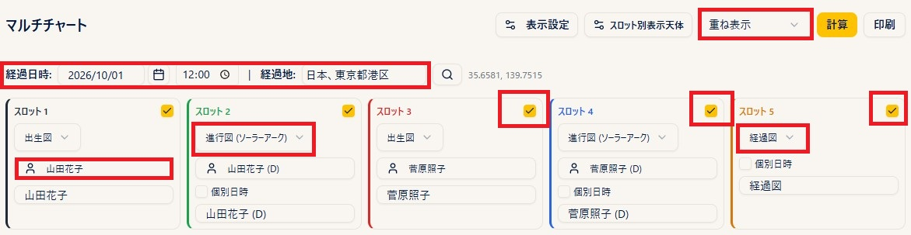
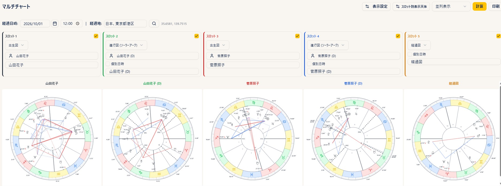
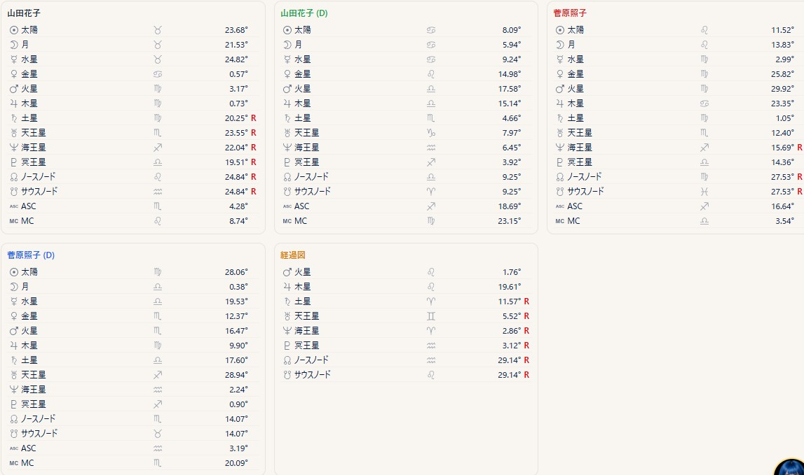
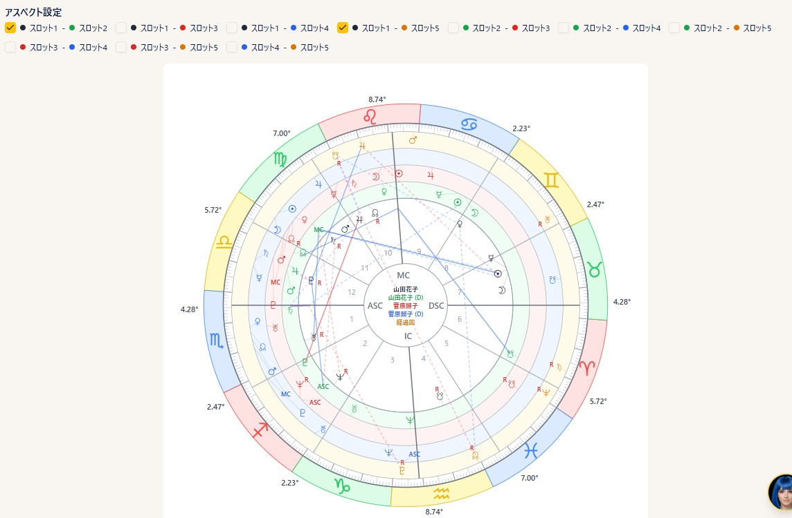

# マルチチャート

!!! abstract "この章について"
    この章では、マルチチャートの使い方をまとめます。マルチチャートは、**最大5枚のチャート** を1画面に **重ねて（重ね表示）** または **横に並べて（並列表示）** 比較する機能です。各スロットに、別々の出生データやチャートの種類を設定できます。マルチチャートは **Max プラン** でご利用いただけます。

## マルチチャートの作り方

### 操作手順

1. メニューから「**マルチチャート**」を開きます。
2. 画面の **スロット（1〜5）** のうち、使う枠の「**有効**」にチェックを入れます。
3. 各スロットで「**チャート種類**」を選びます（**出生図／進行図（セカンダリ）／進行図（ソーラーアーク）／経過図／リターン図**）。
4. 「**出生データを選択**」から対象者を選びます（経過図は出生データ不要）。リターン図では「**リターン天体**」（Sun／Moon／Jupiter／Saturn）と「**検索年**」を指定します。
5. 経過図・リターン図など日付が必要な種類は、上部の「**経過日時**」「**経過地**」を使います。各スロットで「**個別日時**」にチェックを入れると、そのスロットだけ別の日時・場所にできます。
6. 「**重ね表示 / 並列表示**」を選びます。
7. 「**計算**」を押すと、チャートが表示されます。

### 補足説明

- スロットごとに色分けされます。各スロットの「**ラベル**」欄で表示名を変えられます。
- 出生データを選んでいない経過図のスロットは、上部の共通日時で計算されます。ただし、そのスロットで「**個別日時**」を設定している場合は、上部の共通日時よりも個別日時（と個別の場所）が優先されます。

## 重ね表示と並列表示

「**計算**」を押すと、選んだ表示モードでチャートが表示され、その下に **各スロットの天体の位置**（サイン・度数）が一覧で表示されます。

### 補足説明

- **重ね表示**：すべてのチャートを1つの円に重ねて表示します。
- **並列表示**：各チャートを横に並べて表示します。
- ヘッダーの「**重ね表示／並列表示**」のドロップダウンで、計算後もいつでも切り替えられます。

### 各スロットの天体の位置

計算後は、チャートの下に、スロットごとの天体の位置（サイン・度数）が一覧で表示されます。表示する天体は「**スロット別表示天体**」で切り替えられます（後述）。

## スロット間のアスペクト（アスペクト設定）

### 操作手順

1. **重ね表示** で **2枚以上** のチャートを「計算」すると、チャートの上に「**アスペクト設定**」欄が表示されます。
2. 見たい組み合わせ（例：**スロット1 − スロット2**）にチェックを入れると、その2枚の間のアスペクト線が円に表示されます。
3. 組み合わせは複数を同時に選べます。チェックを外すと、その組み合わせの線が消えます。

### 補足説明

- 「アスペクト設定」欄は、**重ね表示** のときだけ表示されます（並列表示では出ません）。
- 各組み合わせの丸印の色は、カラーテーマが「**標準**」のとき、円のリング（スロット）の色と対応しています。「**旧スタナビ紫**」ではリングがすべて同色になり色で見分けられないため、リング（円盤）の位置で組み合わせを確認してください。
- 表示されるアスペクトの種類・オーブは、選択中プリセットのアスペクト設定に準じます。各スロットのチャート種類を **N（ネイタル）／P（進行）／T（経過）** に区分し、その組み合わせのタブ（**N–N／N–P／N–T／P–P／P–T／T–T**）の設定が使われます。区分は、出生図＝**N**、進行図（セカンダリ／ソーラーアーク）＝**P**、経過図・リターン図＝**T** です（[設定](settings.md)の章を参照）。

## 表示・印刷

### 操作手順

1. 「**スロット別表示天体**」から、スロットごとに表示する天体を選べます。表示中のチャートと、下の天体一覧の両方に反映されます。
2. 「計算」後に「**印刷**」ボタンで、チャートとデータを印刷できます。

### 補足説明

- 「**表示設定**」から、アスペクトやハウス記号などをまとめて調整できます（**Plus 以上**）。

!!! info "プラン"
    マルチチャート＝ **Max 以上**。表示設定＝ **Plus 以上**。
