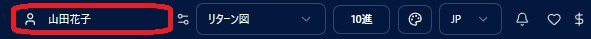
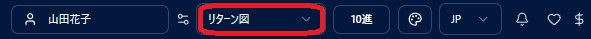
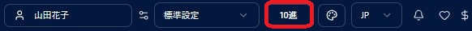

# チャートを開く

!!! abstract "この章について"
    この章では、出生データとプリセットを選んでチャートを開くまでの流れをまとめます。出生データの登録方法は **[出生データ](birth-data.md)** の章を、プリセットの登録・保存方法は **[設定](settings.md)** の章を参照してください。

## 出生データピッカー

### 操作手順

1. ヘッダーの **出生データピッカー**（名前欄）をクリックして一覧を開きます。
2. 一覧から選択するか、上部の検索窓に名前を入力して候補から選択します（フォルダ階層もここに反映されます — [出生データ](birth-data.md)の章の「フォルダ管理」を参照）。
3. 選択するとピッカーに名前が表示され、それ以降のチャートで使われます。

### 補足説明

- **ピッカー内の並び順は「登録順」固定** です（旧スタナビ踏襲）。出生データ一覧画面で設定した並び順（氏名／生年月日／登録日／カスタム順）はピッカーには引き継がれません。件数が多いときは **検索窓** を使うのが便利です。
- 出生データが **未選択** の場合、一重円などのメニューを押すと、「現在日時 × デフォルト観測地」での **経過図** がデフォルトでセットされます。編集ボタンから日時や場所を変えて、そのままチャートを作成することもできます。

## プリセット選択とメニュー

### 操作手順

1. ヘッダーの **プリセットピッカー** で、使いたいプリセットを選択します。
2. メニューから、作りたいチャートの種類（**一重円／三重円／二重円／未来予測 など**）を選びます。
3. 「**チャートを表示**」を押すと、選択したプリセットでチャートが表示されます。

### 補足説明

- どの種類のチャートでも、ヘッダーで選択したプリセットがそのまま使われます。
- チャート画面でも「**表示設定**」パネルから、その場で天体・アスペクトを切り替えられます（**Plus 以上のプラン** でご利用いただけます）。変更した内容は「**上書き保存**」「**別名で保存**」のいずれかでプリセットに反映できます。詳しくは[一重円](single-chart.md)の章の「表示設定」で説明します。

## 度数表記の切り替え（10進法／60進法）

### 操作手順

1. ヘッダーの「**10進**」（または「**60進**」）ボタンを押すと、度数の表記が切り替わります。
2. **10進** は度を小数で表します（例：15.50°）。**60進** は度・分で表します（例：15°30'）。

### 補足説明

- 切り替えは、チャート円盤の度数表示・右パネルの天体表・印刷など、アプリ全体に反映されます。
- どちらの表記でも計算内容は同じです。読み慣れたほうをお使いください。
