# ヘッダーとLISAガイド

!!! abstract "この章について"
    この章では、画面上部の **ヘッダー**（出生データピッカー・プリセット・度数表記・お知らせなどのアイコン）と、画面右下の **LISAガイド**（LISA の顔アイコン）の使い方を、項目ごとにまとめます。出生データの登録方法は **[出生データ](birth-data.md)** の章を、プリセットの登録・保存方法は **[設定](settings.md)** の章を参照してください。

## ヘッダーの各項目

ヘッダーは、どの画面でも上部に共通で表示されます。左から順に説明します。

### 出生データピッカー

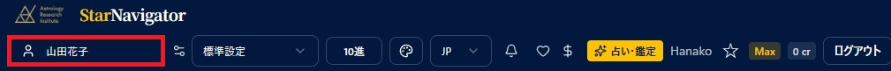

- ヘッダー左端の **名前欄** をクリックすると、出生データの一覧が開きます。一覧から選ぶか、上部の検索窓に名前を入力して選びます（フォルダ階層も反映されます — [出生データ](birth-data.md)の章の「フォルダ管理」を参照）。
- 選ぶと、それ以降に開くチャートでその出生データが使われます。
- ピッカー内の並び順は **登録順で固定** です（旧スタナビ踏襲）。出生データ一覧画面で設定した並び順はピッカーには引き継がれません。件数が多いときは検索窓が便利です。
- **未選択** のまま一重円などのメニューを押すと、「現在日時 × デフォルト観測地」での **経過図** がセットされます。編集ボタンから日時・場所を変えて、そのままチャートを作成することもできます。

### プリセット

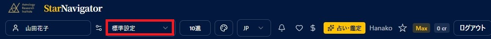

- 使いたい **プリセット** を選びます。どの種類のチャートでも、ここで選んだプリセットが使われます。
- チャート画面の「**表示設定**」パネルから、その場で天体・アスペクトを切り替えることもできます（**Plus 以上**）。変更は「**上書き保存**」「**別名で保存**」でプリセットに反映できます（[設定](settings.md)の章を参照）。

### 度数表記（10進／60進）

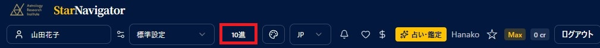

- 「**10進**」「**60進**」ボタンで度数の表記を切り替えます。**10進** ＝度を小数（例：15.50°）、**60進** ＝度・分（例：15°30'）で表します。
- チャート円盤・右パネルの天体表・印刷など、アプリ全体に反映されます。どちらの表記でも計算内容は同じです。

### カラーテーマ

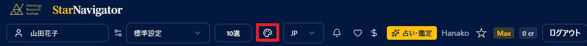

- パレットのアイコンで、チャートの配色（**標準（パステル）／旧スタナビ紫**）をその場で切り替えます。一重円・二重円・三重円など全チャート共通です。詳しくは [設定](settings.md) の章の「カラーテーマ」を参照してください。

### 言語（日本語／English）

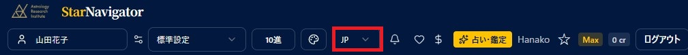

- 表示言語を **日本語／English** で切り替えます。

### お知らせ・プチ占い（ベル／ハート／ドル）

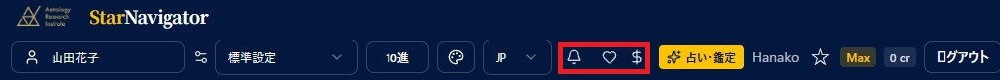

- **ベル（お知らせ）**：新機能やメンテナンスなどのお知らせ一覧が開きます。未読があるとベルに件数バッジが付きます。
- **ハート（プチ占い・恋愛運）／ドル（プチ占い・金運・仕事運）**：選択中の出生データについて、**恋愛運が良い時期**（ハート）と **金運・仕事運が良い時期**（ドル）を手軽に表示します（**Basic 以上**）。出生データを選んでから押してください。

### 占い・鑑定

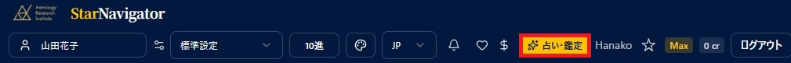

- **占い・鑑定** のページ（プチ占いや LISA の AI 鑑定などのハブ）を開きます。詳しくは [占い・鑑定](shop.md) の章を参照してください。

### アカウント名

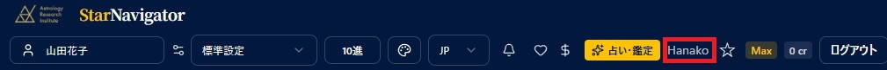

- **ログイン中のアカウント名** が表示されます（表示名は [設定](settings.md) で変更できます）。左端の出生データピッカーの名前とは別で、こちらは **ログインしているご本人** を表します。

### 今日の星のエネルギー（星マーク）

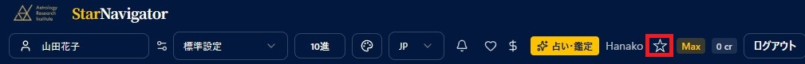

- 星マークを押すと、ログイン時に表示される「**今日の星のエネルギー**」を、もう一度表示します（**Basic 以上**）。[出生データ](birth-data.md) の章の「自分のデータを指定する」で自分を指定しておくと、ご自身の出生図に基づいた内容になります。

### プラン名・クレジット

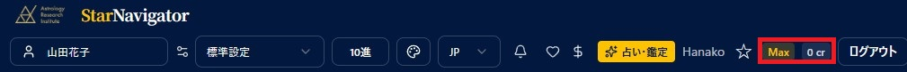

- 現在の **プラン名**（例：Max）と **クレジット残高**（例：0 cr）が表示されます。プラン名を押すとプラン管理、cr を押すとクレジット購入に進みます。詳しくは [プラン・クレジット](plan-credits.md) の章を参照してください。

## LISAガイド（画面右下の LISA アイコン）

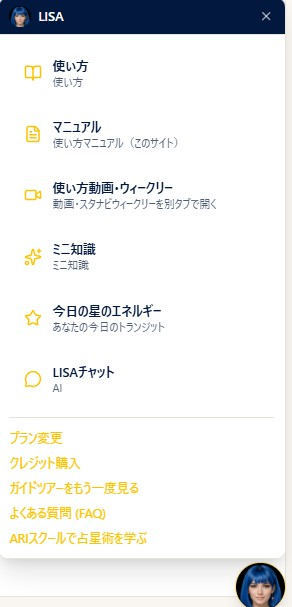

画面の右下にいつも表示されている **LISA の顔アイコン** を押すと、ガイドのパネルが開きます。今見ている画面に合わせて、使い方やヒントを案内します。もう一度アイコンを押すか「×」で閉じます。

### パネルのメニュー

- **使い方**：いま開いている画面の操作ガイドを表示します（画面ごとに内容が変わります）。ご利用のプランで使えない機能には、必要なプラン名のバッジが付きます。
- **マニュアル**：この使い方マニュアル（当サイト）を別タブで開きます。
- **使い方動画・ウィークリー**：ARI 公式サイトの使い方動画・スタナビウィークリーのバックナンバーを別タブで開きます。
- **ミニ知識**：その画面に関連する占星術のちょっとした知識を表示します。
- **今日の星のエネルギー**：あなたの今日のトランジットを表示します（**Basic 以上**）。
- **LISA チャット**：選択中の出生データに基づいて、AI が対話形式で鑑定します（**Basic 以上**。利用には **クレジット** が必要です）。詳しくは [AIレポート・LISAチャット](ai-report.md) の章を参照してください。

### パネル下部のリンク

- **プラン変更** / **クレジット購入**：プラン変更・クレジット購入の画面を開きます（ログイン時に表示）。
- **ガイドツアーをもう一度見る**：初回に表示される操作ツアーを、もう一度再生します。
- **よくある質問（FAQ）** / **ARI スクールで占星術を学ぶ**：それぞれ公式サイトの該当ページを別タブで開きます。
