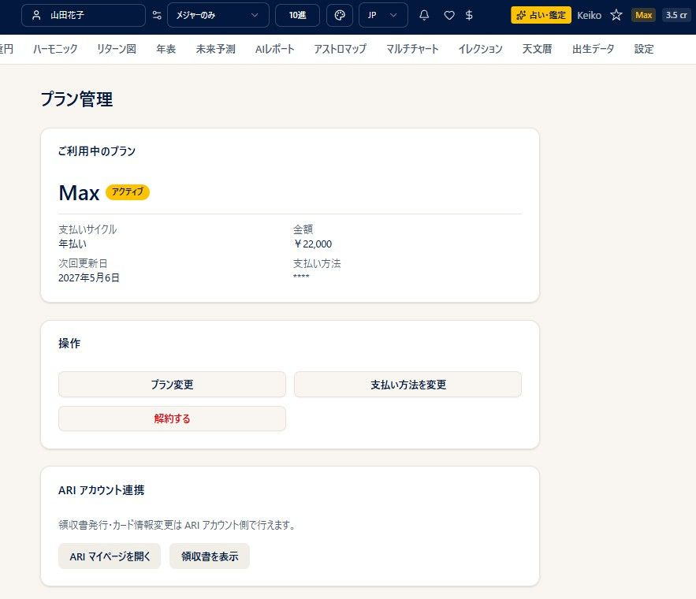
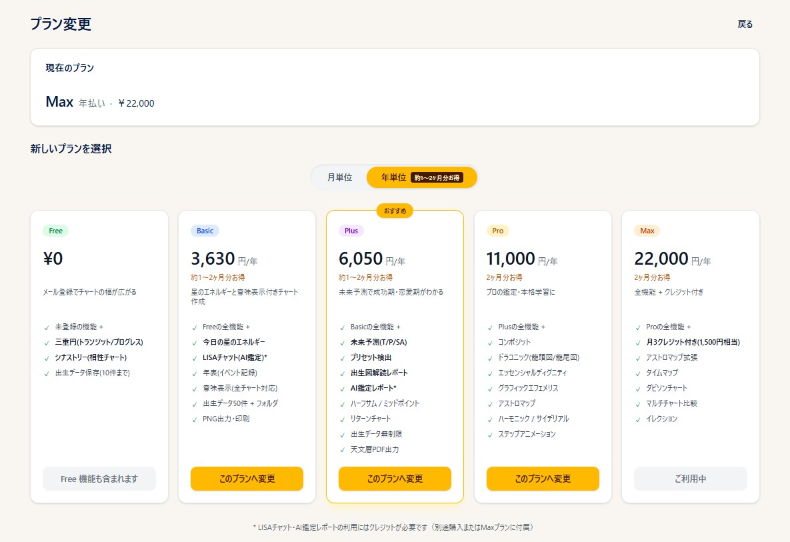
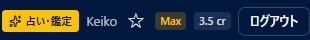

# プラン・クレジット

!!! abstract "この章について"
    この章では、プラン（サブスクリプション）とクレジットの確認・申込・変更・購入をまとめます。プランの申込・お支払い・クレジット購入・領収書などの一部は、**ARI のマイページ（公式サイト）** で行います。

## プランの確認・申込

### 操作手順

1. ヘッダー右の **プラン名ボタン**（例：**Basic**）を押すと、「**プラン管理**」画面が開きます。無料プランの方は「**申込**」、未ログインの方は「**ログイン**」ボタンになります。
2. 「プラン管理」では、現在のプラン・**支払いサイクル（月払い／年払い）**・金額・次回更新日・支払い方法を確認できます。
3. 新しく申し込むときは、「**申込**」→「**プランお申込み**」でプランと月／年サイクルを選び、支払い方法（**登録済みカード／新しいカード／銀行振込〔年払いのみ〕**）を選んで、規約に同意して「**申し込む**」を押します。

### 補足説明

- **Basic の月払い・新規のみ、30 日間の無料体験** があります。
- カード決済は Omise で処理され、カード番号はスタナビには保存されません。
- ログイン・新規登録・お支払いの詳細は、ARI（公式サイト）側で行います。

## 料金

| プラン | 月額（税込） | 年額（税込） |
|---|---|---|
| Basic | 330 円 | 3,630 円 |
| Plus | 550 円 | 6,050 円 |
| Pro | 1,100 円 | 11,000 円 |
| Max | 2,200 円 | 22,000 円 |

- 年払いは、月払いより **約 1〜2 か月分お得** です。**銀行振込は年払いのみ** ご利用いただけます。
- **Max プランには毎月 3 クレジット（1,500 円相当）が付きます**。AI 機能（LISA チャット・AI リサーチレポートなど）をお使いの方には、実質的に Pro よりお得です。
- 各プランでできること（機能の詳細）は、[**料金・機能の比較ページ**](https://starnavi.arijp.com/lp) をご覧ください。申込・変更画面のプラン比較表でも確認できます。

## プラン変更・解約

「**プラン変更**」「**解約する**」のボタンは、上の **プラン管理** 画面の「操作」欄にあります。「プラン変更」を押すと、「料金」の節で示したプラン選択画面が開きます。

### 操作手順

1. 「プラン管理」→「**プラン変更**」でアップグレード／ダウングレードできます。
    - **アップグレード**：即時反映（残り期間を差し引いた差額を課金）。
    - **ダウングレード**：期間末まで現プランを継続し、次回更新時に切り替わります。
2. 「**解約する**」で、期間末での解約を予約できます（途中解約による返金はありません）。
3. 予約後は「**解約を取り消す**」「**変更予約を取り消す**」で取り消せます。

### 補足説明

- **年払い → 月払い** のアップグレードは、残額の一部が失われる場合があり、警告が表示されます。
- 解約後 **1 か月以内** であれば、再開時にデータを復活できます。

## クレジット

### 操作手順

1. ヘッダーの「**◯ cr**」ボタンで、クレジット残高を確認できます。
2. クレジットの購入は、そのボタン（または各機能の「**クレジットを購入**」）から、**ARI マイページ**（別タブ）で行います。

### 補足説明

- クレジットは、**LISA チャット（AI 鑑定）／AI リサーチレポート／未來予報カレンダーの生成** などで消費します。
- **Max プランには毎月 3 クレジット（1,500 円相当）** が付きます。
- クレジットの購入・領収書の発行・カード情報の変更は、ARI マイページで行います。
