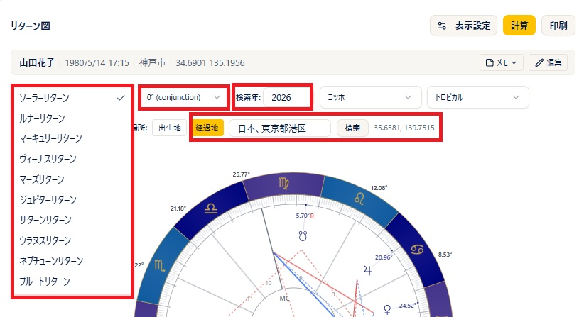
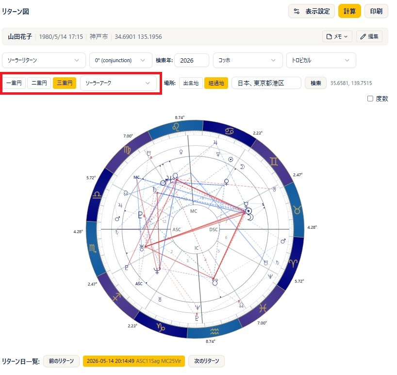
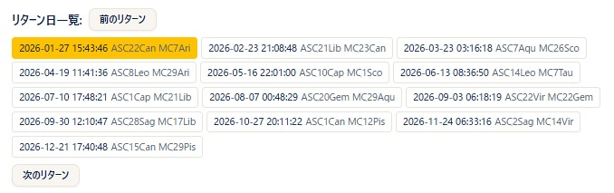
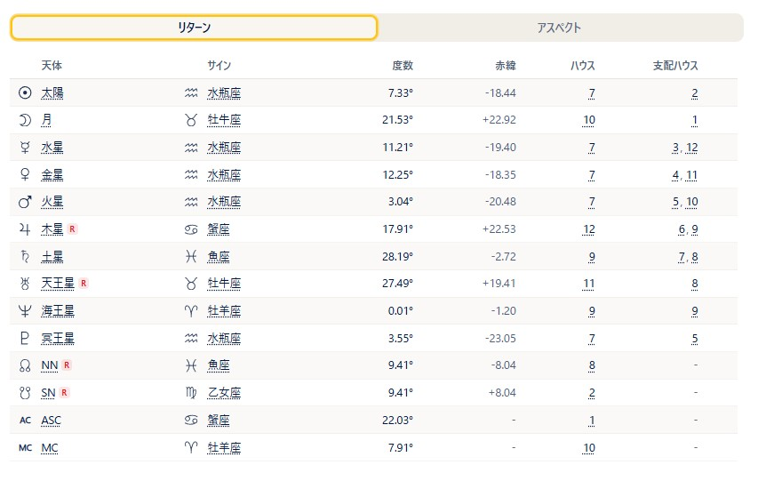

# リターン図

!!! abstract "この章について"
    この章では、リターン図（ある天体が出生時と同じ位置に戻る瞬間の図）の使い方をまとめます。**ソーラーリターン**・**ルナーリターン** をはじめ、太陽から冥王星まで各天体のリターン図を作成でき、**一重円・二重円・三重円** の3つの表示に切り替えられます。リターン図は **Plus プラン以上** でご利用いただけます（太陽・月・土星以外の天体のリターンは **Pro 以上**）。

    トランジット（経過）の基礎は、ARI公式サイトの [トランジット](https://www.arijp.com/basis/transit) もあわせてご覧ください。

## リターン図の作り方

### 操作手順

1. メニューから「**リターン図**」を開きます。ヘッダーで **出生データ** を選びます（未選択のときは「**計算**」を押せません）。
2. データをその場で直したいときは **鉛筆（編集）** から修正し、「**再計算**」で反映します。
3. 左端の **リターン種類** の選択肢から、**ソーラーリターン／ルナーリターン／マーキュリーリターン／ヴィーナスリターン／マーズリターン／ジュピターリターン／サターンリターン／ウラヌスリターン／ネプチューンリターン／プルートリターン** のいずれかを選びます。
4. 隣の **位相角** の選択肢から、**0°（合）／90°（スクエア）／180°（オポジション）／270°（スクエア）** を選びます（既定は0°＝通常のリターン）。
5. 「**検索年**」に、リターンを探したい年を入力します（既定は今年）。
6. 「**場所**」で **出生地** または **経過地** を選びます（経過地の使い方は後述の「場所を指定する」「ソーラーリターンで開運する」を参照）。
7. 必要に応じて **ハウスシステム** を選びます。
8. 「**計算**」を押すと、リターン図が表示されます。

### 補足説明

- リターン種類で選んだ天体が、出生時と同じ黄経（＝合）に戻る瞬間の図が計算されます。
- **位相角** を 90°・180°・270° にすると、天体が出生位置から4分の1・半分・4分の3だけ進んだ瞬間の図になります。スクエアやオポジションになる時期を探したい場合にご利用ください。
- 計算すると、チャートの下にリターンの正確な年月日・時刻が表示されます。
- **検索年** の年内に該当するリターンがない場合は「**この期間にリターンはありません**」と表示され、「**前のリターンを探す**」「**次のリターンを探す**」ボタンで前後の年を探せます。
- ハウスシステムを切り替えると、計算済みのデータで自動的に再計算されます。

!!! info "プラン"
    リターン図（ソーラー・ルナー・サターン）＝**Plus プラン以上**。それ以外の天体（水星〜冥王星）のリターンは **Pro プラン以上** です。

## 表示モードを切り替える

### 操作手順

1. モード切り替えボタンで **一重円 / 二重円 / 三重円** を選びます（既定は二重円）。
2. 三重円を選んだときは、**ソーラーアーク / セカンダリー** の選択肢から進行法を選べます。
3. モードを切り替えると、必要なデータが自動的に再計算されます。

### 補足説明

- **一重円**：リターン図（R）だけを1つの円で表示します。
- **二重円**：内円＝**ネイタル（N）**、外円＝**リターン（R）** を重ねて表示します。
- **三重円**：内円＝**ネイタル（N）**、中円＝進行（**ソーラーアーク＝D／セカンダリー＝P**）、外円＝**リターン（R）** を重ねて表示します。
- 各リングに表示する天体は、表示設定（天体表示）に従います。

!!! warning "外円（リターン図）の表示天体はトランジットの設定に準じます"
    二重円・三重円の外円に表示されるリターン図（R）の天体は、設定（天体表示）の **T：トランジット** の内容に準じます。トランジットの設定では **ASC・MC・太陽・月** などのチェックが外れていることが多いため、リターン図で表示したい場合は、設定（または表示設定）で T にこれらのチェックを入れてください。忘れやすいのでご注意ください。

## 場所を指定する

### 操作手順

1. 「**場所**」の切り替えで、**出生地** または **経過地** を選びます（既定は出生地）。
2. **経過地** を選んだときは、入力欄に地名を入れます（候補から選択、または「**検索**」ボタンで検索＝Basic 以上）。
3. 場所を変えたら「**計算**」を押し直すと、その土地でのリターン図が計算されます。

### 補足説明

- **出生地**：出生データの緯度・経度でリターン図を計算します。
- **経過地**：入力した土地の緯度・経度でリターン図を計算します（引越し先など、現在いる場所で見たいときに使います）。緯度・経度が確定すると、欄の右に数値が表示されます。
- 場所を変えると、天体のサイン・度数は変わりませんが、**ASC・MC やハウスの配置** が変化します。

## ソーラーリターンで開運する

ソーラーリターン図は、**誕生日を迎えるその瞬間にいる場所** で読むため、その時期に過ごす場所を変えると、同じ瞬間でも **ASC・MC やハウスの配置が異なるリターン図** になります。これを利用して、望ましい配置になる土地で誕生日の時期を過ごす、という開運の使い方ができます。

### 操作手順

1. リターン種類で「**ソーラーリターン**」を選び、**検索年** を指定します。
2. 「**場所**」で「**経過地**」を選び、候補地の地名を入力して「**計算**」を押します。
3. チャートの下に表示されるリターンの正確な日時と、**ASC・MC・ハウスの配置** を確認します。
4. 候補地を変えながら計算し直し、配置を比較して行き先を検討します。

### 補足説明

- 場所を変えても天体のサイン・度数は変わりません。変わるのは **ASC・MC とハウスの配置** です。
- どのような配置を目指すかは、占星術の解釈に関わるためこのマニュアルでは扱いません。講座等で学んだ内容に基づいてご判断ください。

## リターン日を選ぶ

### 操作手順

1. チャートの下の「**リターン日一覧**」に、該当年のリターン日時が並びます。日付ボタンを押すと、その日のリターン図に切り替わります。
2. 「**前のリターン**」「**次のリターン**」ボタンで、前後のリターンへ移動できます。
3. 一覧の端まで来ると、これらのボタンは前年・翌年のリターンを探す動作に変わります。

### 補足説明

- いま表示中のリターン日は **黄色（ハイライト）** で示されます。日付を選び直すと、表示中のチャートに合わせてハイライトも追従します。
- 各日付には、逆行中のリターンには赤い「**R**」、その図の **ASC・MC** の度数が併記されます。
- ソーラーリターンは1年に1回ですが、ルナーリターンのように候補日が多いリターンでは、一覧から目的の月の図を選べます。

## 右パネルの見方

### 補足説明

- タブは表示モードにより変わります。**一重円＝リターン(R)／アスペクト**、**二重円＝ネイタル(N)／リターン(R)／アスペクト**、**三重円＝ネイタル(N)／ディレクション(D)／リターン(R)／アスペクト** です。
- **ネイタル(N)／ディレクション(D)／リターン(R)** タブ：各リングの天体表（天体・サイン・度数・ハウスなど）を表示します。
- **アスペクト** タブ：表示モードに応じて節に分かれてアスペクトグリッドを表示します。二重円では **N-N／N-R／R-R**、三重円では **N-N／N-D／N-R／D-D／D-R／R-R** の節に分かれます。
- 円盤上の天体をクリックすると、その天体のアスペクト一覧がポップアップします。**ASC・MC** などのアングルもクリックできます。
- リターンはトランジット扱いで計算されるため、ネイタルとの関係は N-T（＝N-R）系のアスペクトとして表示されます。

## 表示・印刷

### 操作手順

1. 二重円・三重円では「**度数**」にチェックを入れると、円盤に各天体の度数が表示されます。
2. 「**表示設定**」ボタンから、その場で表示天体・アスペクトを調整できます（**Plus プラン以上**）。
3. 「**印刷**」ボタンで、リターン図とデータを印刷できます（**Basic プラン以上**・縦向き）。
4. 円盤をクリックすると拡大表示になり、拡大画面から「**PNG**」で画像を保存できます（PNG保存は **Basic プラン以上**）。

### 補足説明

- 印刷・PNG のファイル名には「リターン図」と出生データの名前が入ります。
- 度数の表記（10進／度分）は、設定の度数モードに従います。
- 出生データを編集して計算した図には、印刷時に編集中である旨の注記が付きます。

!!! info "プラン"
    リターン図の利用＝**Plus プラン以上**／地名検索＝**Basic 以上**／印刷・PNG保存＝**Basic 以上**／表示設定＝**Plus 以上**。
