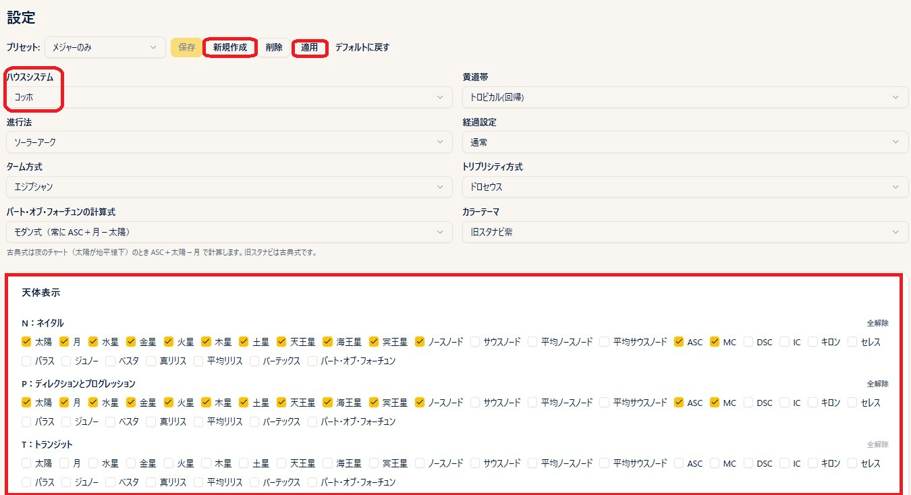
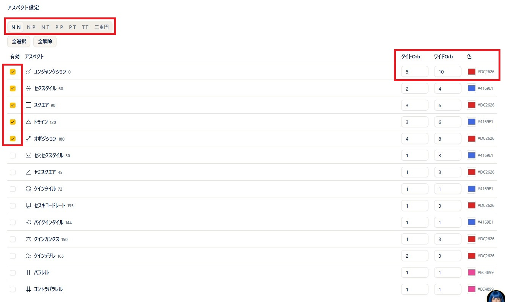
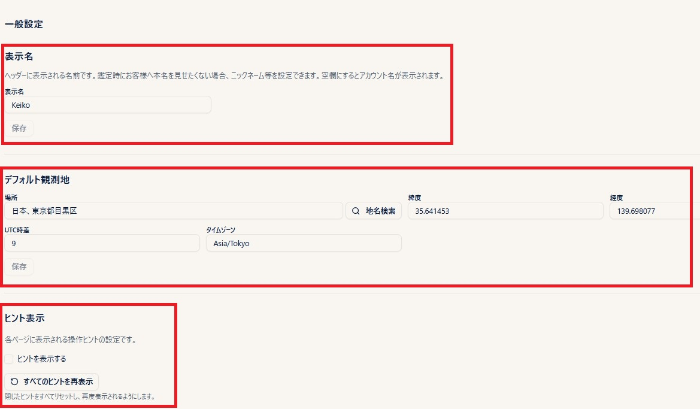

# 設定

!!! abstract "この章について"
    この章では、プリセット・カラーテーマ・表示名・デフォルト観測地・ヒント表示など、全般的な設定を解説します。

## プリセットの作り方

### 操作手順

1. ヘッダーの「**設定**」から設定画面を開きます。
2. 「**天体表示**」の **N（ネイタル）／ P（進行）／ T（経過）** の各セクションで、各円盤に表示する天体をチェックします（P はソーラーアーク・プログレッションのいずれもここの設定を使います）。
3. **アスペクト設定** はタブで切り替え、**N–N ／ N–P ／ N–T ／ P–P ／ P–T ／ T–T ／ 二重円（シナストリー用）** ごとに、表示したいアスペクトにチェックを入れ、**タイトオーブ** と **ワイドオーブ** を入力します（タイトオーブは実線、ワイドオーブは点線で描画されます）。
    
4. 各アスペクトの色はカラーピッカーから自由に選べます。
5. プリセット名を入力して「**新規作成**」→「**保存**」を押します。
6. 「**適用**」を押すと、プリセット名の横に「*」が付き、ヘッダーのプリセットピッカーにも反映されます。
7. **ハウスシステム** もこの画面で選んでおくと、各チャート画面でデフォルトとして使われます（チャート画面で都度切り替え可能です）。

### 補足説明

- プリセットには天体・アスペクトのほかに、**ハウスシステム・黄道帯・進行法（ソーラーアーク／プログレッション）・経過設定・ターム方式・トリプリシティ方式・パート・オブ・フォーチュンの計算式・カラーテーマ** も含まれます。よく使う組み合わせをまとめて保存しておけます。特別な目的がない限り、黄道帯・経過設定・ターム方式・トリプリシティ方式・パート・オブ・フォーチュンの計算式は変更せず、デフォルトのままで問題なくお使いいただけます。
- パート・オブ・フォーチュンの計算式は、**モダン式**（常に ASC＋月−太陽）と **古典式**（夜のチャート＝太陽が地平線下のとき ASC＋太陽−月）を選べます。旧スタナビは古典式です。
- ヘッダーの **プリセットピッカー** から、これから作るチャートに使うプリセットを切り替えられます。選択中のプリセットが、そのあと新規に開くチャートに反映されます。
- 既存プリセットを選択して内容を編集し、「**上書き保存**」で更新、「**別名で保存**」で新規プリセットとして保存できます。
- チャート画面でも「**表示設定**」パネルから、その場で天体・アスペクト・オーブを変更できます（Plus 以上のプラン）。変更した内容は「上書き保存」「別名で保存」のいずれかでプリセットに反映できます。
- プリセットの作成・保存自体は Basic 以上のプランでご利用いただけます。

## カラーテーマ（配色の切り替え）

!!! info "カラーテーマ"
    チャートの配色（カラーテーマ）を切り替えられます。従来の **標準（パステル）** に加え、**旧スタナビ紫** を選べます。

### 操作手順

1. ヘッダーの「**設定**」から設定画面を開きます。
2. 設定画面上部の **カラーテーマ** 欄（ハウスシステムなどと同じ並び）で「**標準**」または「**旧スタナビ紫**」を選びます。
3. 選んだ配色が、以降に開くチャートに反映されます。

### 補足説明

- カラーテーマはプリセットの一部として保存されます。「標準のプリセット」「旧スタナビ紫のプリセット」のように使い分けることもできます。
- **ヘッダーにあるカラー切替ボタン** からも、その場でワンタップで配色を切り替えられます（一重円・二重円・三重円など全チャート共通）。
    
- ビギナーの一重円でも、右肩のボタンで同じ切り替えができます。

## 表示名の変更（ヘッダーに表示される名前）

### 操作手順

1. ヘッダーの「**設定**」から設定画面を開き、下部の「**一般設定**」までスクロールします。
2. 「**表示名**」欄に、ヘッダーに表示したい名前を入力します。
3. 「**保存**」を押します。

### 補足説明

- ここで設定した名前が、スタナビのヘッダーに表示されます。**鑑定時にお客様へ本名を見せたくない場合**、ニックネームや屋号などを設定しておくと安心です。
- 空欄にして保存すると、アカウントにご登録のお名前が表示されます。

## デフォルト観測地

### 操作手順

1. 設定画面下部の「**一般設定**」にある **デフォルト観測地** の欄を開きます（上の画像参照）。
2. 場所の欄に地名を入力し、「**地名検索**」を押して候補から選択します（緯度・経度・UTC 時差・タイムゾーンが自動でセットされます）。
3. 「**保存**」を押します。

### 補足説明

- デフォルト観測地を登録しておくと、**経過図（三重円）** や **未来予測** を作るときの初期経過地として使われます。チャート画面で都度別の地名に変更することもできます。
- 出生データピッカーの **共有データ**（新月・満月などの天文イベント）で場所が未設定のデータを選んだときも、この観測地が自動で補われます（[出生データ](birth-data.md) の章の「共有データ」を参照）。

## ヒント表示（ポップアップ案内を出す・出さない・再表示する)

### 操作手順

1. 設定画面下部の「**一般設定**」にある **ヒント表示** の欄を開きます（上の画像参照）。
2. 「**ヒントを表示する**」にチェックを入れると、各ページの操作ヒント（ポップアップの案内）が表示されます。チェックを外すと一括で非表示になります。
3. 「**すべてのヒントを再表示**」ボタンを押すと、一度 ✖ で閉じたヒントもリセットされ、もう一度最初から表示されます。

### 補足説明

- 操作ヒントは、各画面の使い方をその場で案内するポップアップです。操作に慣れてきたら OFF にしてすっきり使い、久しぶりに使う機能があるときに再表示する、という使い方ができます。
- 個別のヒントを ✖ で閉じただけでは、そのヒントだけが出なくなります。全部まとめて出し直したいときに「すべてのヒントを再表示」を使ってください。
