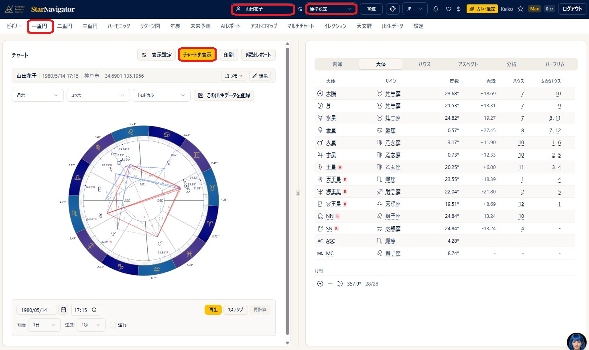
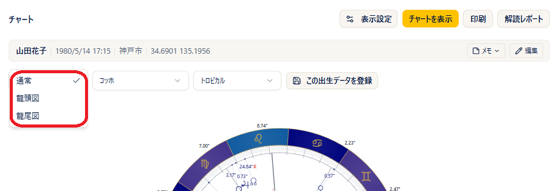
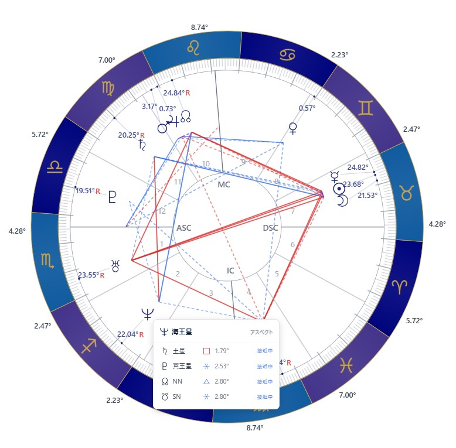
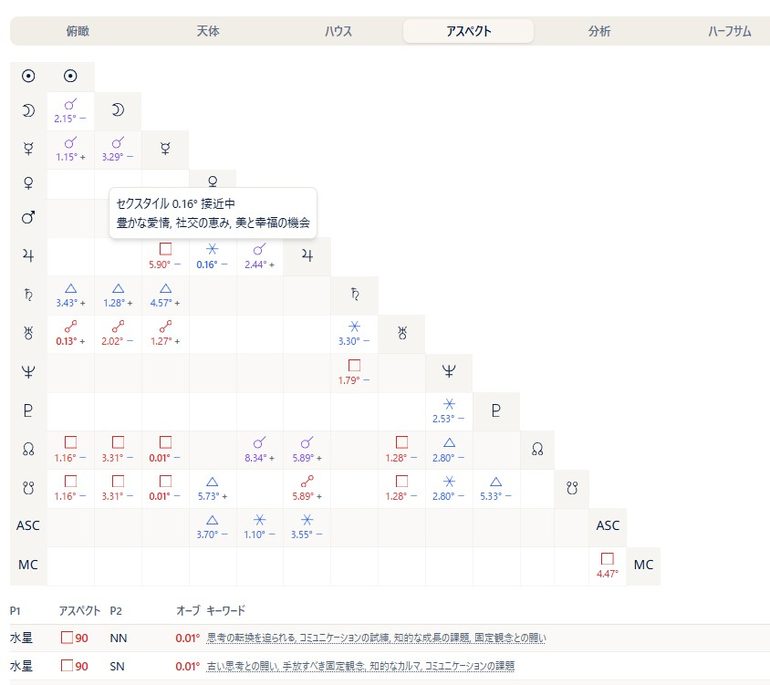
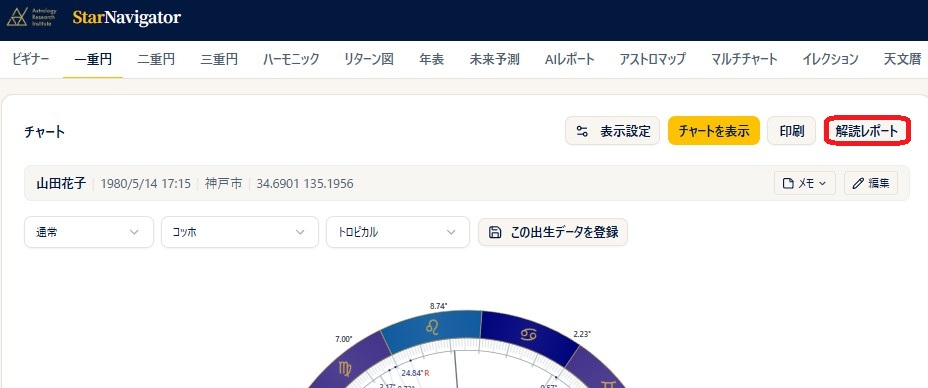
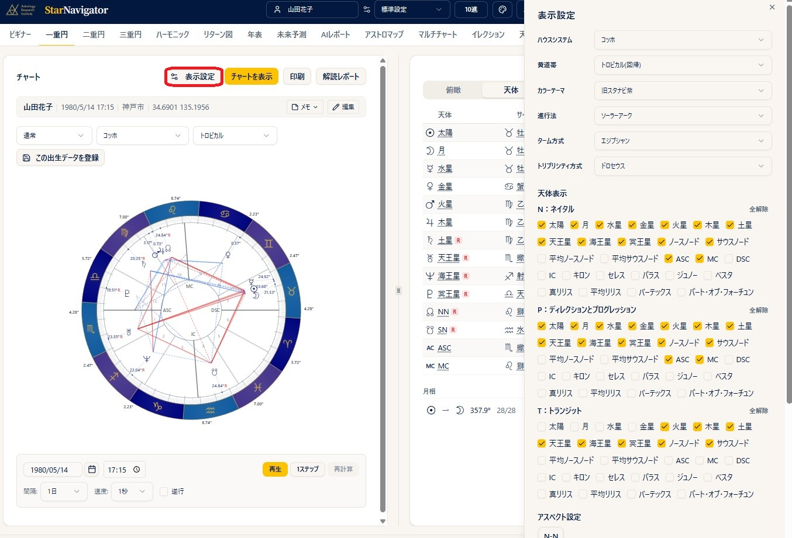
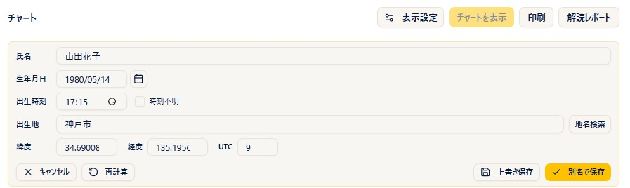

# 一重円

!!! abstract "この章について"
    この章では、一重円（ネイタルチャート）の作成・表示・編集・印刷をまとめます。

## 一重円の作り方

### 操作手順

1. ヘッダーの **出生データピッカー** から出生データを選びます。
2. **プリセットピッカー** で使うプリセットを選びます。
3. メニューから「**一重円**」を選びます。
4. 「**チャートを表示**」を押すと、左側に出生図（ネイタル）、右側にデータタブが表示されます（PCの場合）。スマホの場合は、出生図が上、データタブが下と、上下に並びます。

### 補足説明

- 度数の表記は、ヘッダーで **10進法 / 60進法** を切り替えられます。
- PC では、チャートとデータパネルの境にある中央のバーをドラッグして、左右の幅を調整できます。

### 一重円の画面で出生データを入力・登録する

- 出生データピッカーから選ばずに、**一重円の画面で直接データを入力** してチャートを作ることもできます。画面上部の **編集** ボタンから日時・場所を入力して「**再計算**」を押すだけです（登録は不要）。短い時間で鑑定を行う場合などに便利な使い方です（詳しくは後述の「出生データの編集・再計算」）。
- 入力したデータを登録したいときは、チャート上部の「**この出生データを登録**」ボタンを押します。名前（プランによってはフォルダも）を付けて登録でき、登録後はそのデータが選択された状態になるので、そのまま他のチャートでも使えます。

### その瞬間の経過図を出す（ホラリー等）

- 出生データピッカーが **未選択** のまま「一重円」ボタンを押すと、**押した時点の日時** と、設定済みの **デフォルト観測地** で経過図が作成されます。ホラリーなどで「今この瞬間」のチャートを見たいときに、そのまま使えます。

## 龍頭図・龍尾図（ドラコニックチャート）

一重円では、通常の出生図のほかに **龍頭図・龍尾図** を表示できます（**Pro 以上のプラン**）。龍頭図は、一般に **ドラコニックチャート** と呼ばれるものです。

### 操作手順

1. チャート上部（出生データ表示の下）にある、「**通常**」と表示されたチャートタイプの選択を開きます。
2. 「**龍頭図**」または「**龍尾図**」を選ぶと、チャートとデータタブがすぐに切り替わります（再計算の操作は不要です）。
3. 「**通常**」に戻すと、元の出生図に戻ります。

### 補足説明

- **龍頭図** はノースノード（ドラゴンヘッド）が牡羊座0度に来るように、**龍尾図** はサウスノード（ドラゴンテイル）が牡羊座0度に来るように、全天体・全ハウスカスプを同じ角度だけ回転させた図です。
- ハウスシステムは、通常の一重円で選んでいるものをそのまま引き継ぎます。
- 印刷される場合は、ヘッダーとファイル名に「龍頭図」「龍尾図」と表示されます。

## チャート表示とパネルの説明

### 操作手順

1. 「**チャートを表示**」を押すと、左側にチャート、右側にデータが表示されます（スマホの場合は下に表示されます）。
2. 右側は、タブを切り替えてさまざまなデータを表示できます。

### 補足説明

{ width="460" }

- チャートの外側の度数は、ハウスカスプの度数です。
- チャート上の天体をクリックすると、その天体に対するアスペクトの一覧をポップアップで表示できます。アスペクトが接近中か分離中かも表示されます。
- データタブに表示されるのは、選択している「**プリセット**」で選んでいる項目だけです。各タブに表示される内容は次のとおりです。
    - **俯瞰タブ**: 旧スタナビと同じレイアウトで、天体とハウスの情報を並べて表示し、その下にアスペクトグリッドを表示します。
    - **天体タブ**: 天体 / サイン / 度数 / 赤緯 / 在住ハウス / 支配ハウスを表示します。下線がついた項目（天体・サイン・ハウスなど）はクリックすると意味が表示されます。月相もここに表示されます。
    - **ハウスタブ**: 各ハウスカスプのサインと度数、在住天体、支配星を表示します。
    - **アスペクトタブ**: アスペクトグリッド / オーブ順のアスペクト一覧 / 複合アスペクトを表示します。グリッドの下には、**タイトな（オーブの小さい）アスペクトから順に、キーワード付きの一覧** が並びます。さらにその下には **複合アスペクト（複数の天体が作る特別な図形）も自動で検出して一覧表示** されます。アスペクト一覧やグリッドには、接近中のアスペクトに **−（マイナス）**、分離中のアスペクトに **＋（プラス）** の符号が表示されます。
      
    - **分析タブ**: 月相 / 三区分 / 四区分 / 二区分 / 半球の強調 / ゴークランセクターの天体 / ステリウム / 特殊度数などを表示します。さらにチャート詳細として、「タイトなコンジャンクション/オポジション」「その他のタイトなアスペクト」「最多アスペクト天体」「アンギュラー天体」「ASC の支配星」「エッセンシャルディグニティ」「ドデカテモリー」「アンティシオン」「ミューチュアルリセプション」を表示します（一部、プランによって表示されないものがあります）。
    - **ハーフサムタブ**: ハーフサム（ミッドポイント）を表示します（Plus 以上）。画面上部の設定で、表示内容を切り替えられます。
        - **ハーモ数**: H1(360) / H2(180) / H4(90) / H8(45) / H12(30) / H16(22.5) のボタンから選びます。「カスタム」では 1〜360 の任意の数を入力できます。
        - **軸の種類**: **全軸表示**（ハーフサム軸の一覧）／ **軸刺激表示**（天体に刺激されている軸だけを表示。刺激している天体も表示されます）／ **ツリー表示** ／ **グラフ**（ドットプロット表示。点にカーソルを合わせると天体の組み合わせと度数が表示されます）の4つから選びます。
        - **オーブ**: ±0.5〜10度の範囲で調整できます。
        - **天体**: 対象にする天体をチェックで絞り込みます。「**構成天体ハイライト**」で天体を選ぶと、その天体を含むハーフサムだけが色付きで表示されます。
        - **印刷** ボタンを押すと、いま表示している軸の種類の内容がそのまま印刷されます。

!!! tip "意味をその場で確認できます"
    チャートやデータタブの **下線がついた項目（天体・サイン・ハウス・アスペクトなど）は、クリックするとその意味が表示** されます。辞書を引きながら読む必要がなく、初心者の学習にも、鑑定中の確認にも便利です。

!!! note "複合アスペクトのオーブ"
    複合アスペクトのオーブは、システムで固定されています。

## ステップ計算（チャートを動かす）

チャートの下にある操作で、日時を少しずつ進めながらチャートの変化をアニメーションのように確認できます（**Pro 以上**）。

### 操作手順

1. チャートの下の **間隔**（例：1日）と **速度**（例：1秒）を選びます。
2. 「**再生**」を押すと日時が自動で進み、チャートが変化していきます。「**1ステップ**」を押すと1コマずつ進められます。
3. 「**逆行**」にチェックを入れると、過去へさかのぼる方向に進みます。

## 表示・印刷

### 操作手順

1. 「**印刷**」ボタンで、チャートとデータを印刷できます（**Basic 以上**）。
2. 円盤をクリックすると拡大表示になり、拡大画面から「**PNG**」で画像を保存できます（PNG保存は **Basic 以上**）。

### 補足説明

- 度数の表記（10進／度分）は、設定の度数モードに従います。

## 出生図解読レポート

### 操作手順

1. 一重円画面で「**解読レポート**」ボタンを押します。
2. 出生図解読レポートが別タブで開きます。
3. ブラウザの印刷ダイアログから、「**印刷**」または「**PDF として保存**」を選びます。

### 補足説明

- レポートには、次の項目が表示されます。
    - 個人天体と ASC
    - 三区分・四区分
    - 半球の強調
    - ASC の支配星
    - オーブがタイトなアスペクト
    - 複合アスペクト
    - その他特徴的な点

## 表示設定

### 操作手順

1. チャート画面で「**表示設定**」ボタンを押します。
2. 天体 / アスペクト / オーブ / ハウスシステム / 進行法 などを、その場で切り替えます。
3. チャートと右パネルのデータが即時に再描画されます。

### 補足説明

- 変更した内容を現在のプリセットに上書きしたい場合は、「**上書き保存**」ボタンを押します。
- 新しいプリセットとして残したい場合は、プリセット名を入力して「**新規作成**」を押します。
- どちらも押さずに別画面に移った場合、変更はそのチャートでだけ使われ、プリセットには保存されません。

!!! info "プランについて"
    「表示設定」をチャート画面で使う機能は、Plus 以上のプランでご利用いただけます。

## 出生データの編集・再計算

### 操作手順

1. チャート画面上部の出生データ表示のとなりにある **編集** ボタンを押します。
2. 氏名 / 生年月日 / 出生時刻 / 出生地 を修正します。
3. 「**再計算**」ボタンを押すと、チャートとデータパネルが再計算されます。
4. 元の出生データを上書きしたい場合は「**上書き保存**」、別データとして残したい場合は「**別名で保存**」を押します。
5. 同じように「**メモ**」ボタンから、出生データのメモ欄をその場で編集・保存できます。

### 補足説明

- 出生データピッカーで **未選択** のままチャートを開くと、「現在日時 × デフォルト観測地」での経過図がセットされます。この状態で編集ボタンから日時や地名を変えれば、出生データを登録しなくても、その場でチャートを作成できます。

!!! tip "メモ欄はチャート画面からそのまま更新できます"
    鑑定中に気づいたことは、一重円の画面の「**メモ**」ボタンから **その場で編集・保存** できます。出生データ一覧の画面に戻る必要はありません。保存したメモは、その出生データに紐づいて残ります。
- レクティフィケーション（出生時刻の推定）などで、同じ人のデータを複数バージョン作りたいときは、「**別名で保存**」で名前を変えながら何件でも登録できます。
- この編集・メモ・上書き / 別名保存の仕組みは、三重円・二重円（シナストリー）・未来予測など、他のチャート作成画面でも同じです。
