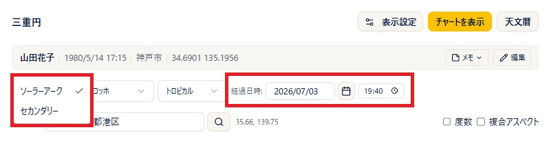
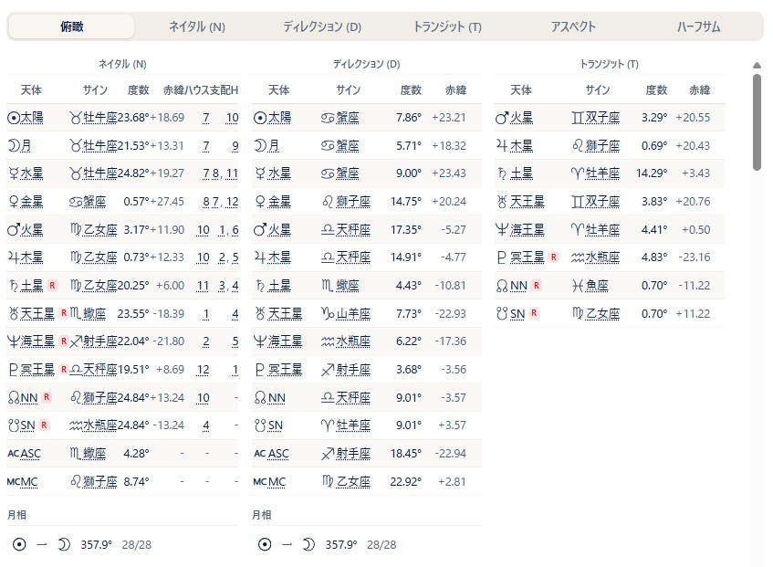
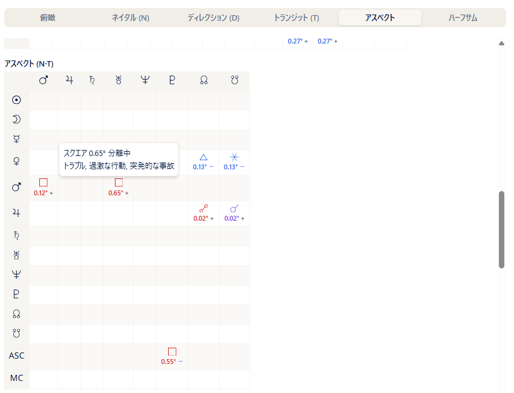
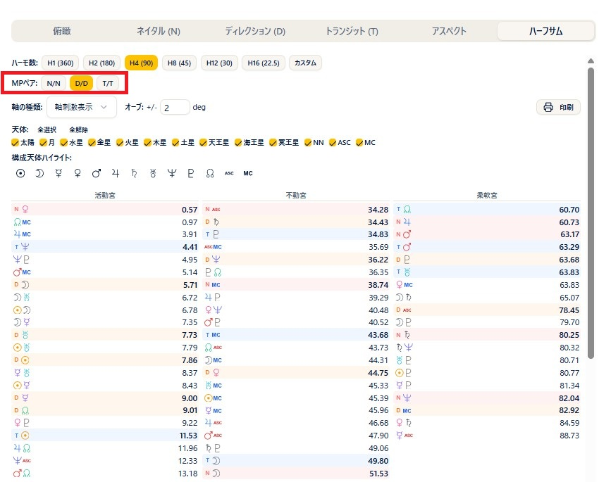
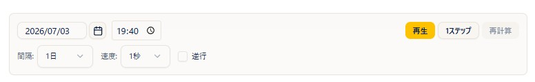
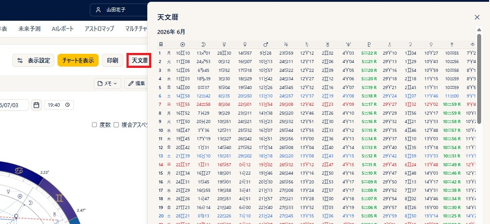
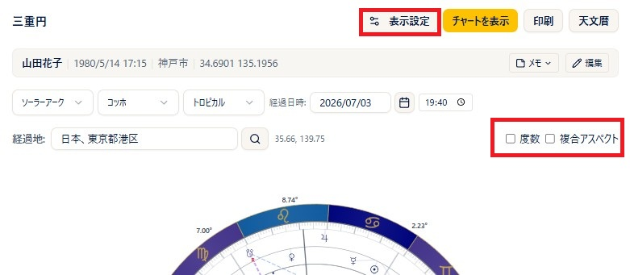

# 三重円

!!! abstract "この章について"
    この章では、三重円（経過図）の使い方をまとめます。三重円は、**内円＝ネイタル（N）**、**中円＝進行**、**外円＝トランジット（経過・T）** の3つを重ねた図です。進行法は **ソーラーアーク** と **セカンダリー**（一日一年法）から選べます。

    トランジットの基礎は、ARI公式サイトの [トランジット](https://www.arijp.com/basis/transit) もあわせてご覧ください。

## 三重円の作り方

### 操作手順

1. メニューから「**三重円**」を開き、ヘッダーで **出生データ** を選びます。データをその場で直したいときは **鉛筆（編集）** から修正し、「**再計算**」で反映します。
2. **進行法** の選択肢から、**ソーラーアーク** または **セカンダリー** を選びます（既定はソーラーアーク）。
3. **経過日時** を入力します（既定は現在の日時）。日付と時刻をそれぞれ指定できます。
4. **経過地** に地名を入力します（候補から選択、または虫眼鏡ボタンで検索＝Basic 以上）。既定は設定の観測地です。
5. 必要に応じて **ハウスシステム** を選びます。
6. 「**チャートを表示**」を押すと、三重円が表示されます。

### 補足説明

- 3つのリングは、カラーテーマが「標準」のとき、内側から **N（ネイタル）＝黒／進行＝緑／T（トランジット）＝赤** です。中円のラベルは進行法により **D（ソーラーアーク）／P（セカンダリー）** と変わります。
- 各リングに表示する天体は、設定プリセットに従います。表示設定でリアルタイムに変更することも出来ます。
- 天体をクリックすると、その天体のアスペクト一覧がポップアップします（N＝黒／進行＝緑／T＝赤のバッジ）。**ASC・MC** などのアングルもクリックできます。

## 右パネルの見方

### 補足説明

- タブは **俯瞰／ネイタル(N)／ディレクション(D)（セカンダリー選択時は「セカンダリー(P)」）／トランジット(T)／アスペクト／ハーフサム** です。
- **俯瞰** タブ：N・進行・T の天体とアスペクトをまとめて一覧できます（旧スタナビと同じレイアウト）。
- **N／D(P)／T** タブ：各リングの天体表（天体・サイン・度数・赤緯・ハウス・支配ハウス）。月相やエッセンシャルディグニティ（**Pro 以上**）も表示されます。
- **アスペクト** タブ：**N-N／N-P（N-D)／N-T／P-P（D-D)／P-T（D-T)／T-T** の節ごとにアスペクトグリッドを表示します。各セルにはオーブと **＋（分離中）／−（接近中）** の符号が表示され、セルをクリックすると、アスペクトの種類・オーブ・接近中／分離中と、その **意味（キーワード）** がポップアップで表示されます。アスペクトグリッドの下には、**複合アスペクト** の一覧が表示されます（「複合アスペクト」のチェックをオンにして計算した場合）。
    
- **ハーフサム** タブ：ハーフサム（ミッドポイント）を表示します（次の節を参照）。

## ハーフサム（N/N・D/D・T/T のミッドポイント）

右パネルの「**ハーフサム**」タブでは、ハーフサム（ミッドポイント）の分析ができます（**Plus 以上**）。「**MPペア**」の切り替えで、**N/N（ネイタル同士）** だけでなく **D/D（進行同士）・T/T（トランジット同士）** のミッドポイントも分析できます。

### 補足説明

- ハーモ数・軸の種類・オーブ・天体の絞り込みなどの操作は、[一重円](single-chart.md) の章の「ハーフサムタブ」と同じです。
- ハーフサムの基礎は、ARI公式サイトの [ハーフサム](https://www.arijp.com/basis/halfsum) もあわせてご覧ください。

## ステップ計算（チャートを動かす）

チャートの下にある操作で、日時を少しずつ進めながらチャートの変化をアニメーションのように確認できます（**Pro 以上**）。

### 操作手順

1. チャートの下の **間隔**（例：1日）と **速度**（例：1秒）を選びます。
2. 「**再生**」を押すと日時が自動で進み、チャートが変化していきます。「**1ステップ**」を押すと1コマずつ進められます。
3. 「**逆行**」にチェックを入れると、過去へさかのぼる方向に進みます。

## 天文暦（エフェメリス）

### 操作手順

1. ヘッダーの「**天文暦**」ボタンを押します（**Plus 以上**）。
2. 経過日時の前月から 3 か月分の天文暦がダイアログで開きます。三重円を作りながら、天文暦で天体の動きを確認していただくことができます。

### 補足説明

- 日ごとに、各天体の度数（サイン・度・分、逆行は R）、イングレスや月相・順行/逆行の切り替わり、**VOC（ボイド）ムーン**、天体どうしのアスペクトなどが表示されます。
- 独立したメニュー「**天文暦**」（PDF生成）も別にあります（[天文暦](ephemeris.md)の章で説明します）。

## 表示・印刷

### 操作手順

1. 「**度数**」にチェックを入れると、各天体に度数が表示されます。
2. 「**複合アスペクト**」にチェックを入れると、複合パターンを計算・表示します（**Basic 以上**。計算に少し時間がかかるので、必要なときだけオンにしてください）。
3. 「**表示設定**」から、その場で天体・アスペクト・ハウス・カラー・進行法などを調整できます（**Plus 以上**）。
4. 「**印刷**」ボタンで、三重円とデータを印刷できます（**Basic 以上**・縦向き）。ハーフサムタブからは横向きで印刷できます。
5. 円盤をクリックすると拡大表示になり、「**PNG**」で画像を保存できます（PNG保存は **Basic 以上**）。

### 補足説明

- 表示設定の「**経過設定**」では、通常のほか「**次回ソーラーリターン**」「**前回ソーラーリターン**」の日時に合わせることもできます。
- 「**小惑星・感受点を表示**」は、Free／ゲスト向けの簡易切り替えです。
- 度数の表記（10進／度分）は、設定の度数モードに従います。
